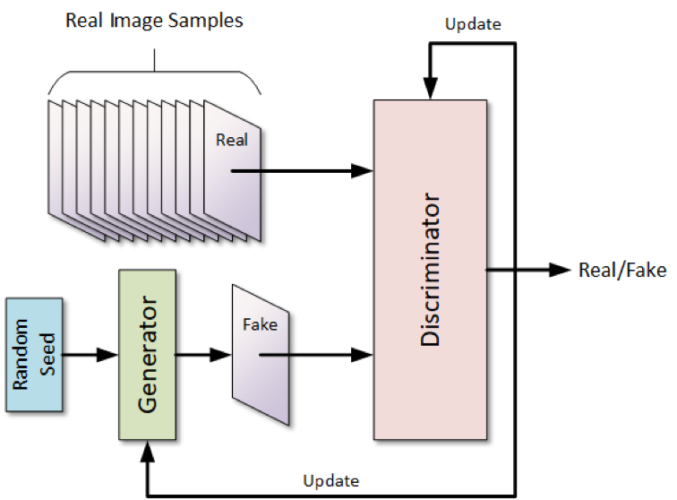

# 1. `Introduction to GAN.`

A Generative Adversarial Network, or GAN, is a type of neural network architecture for generative modeling.

Generative modeling involves using a model to generate new examples that plausibly(
বিশ্বাসযোগ্য) come from an existing distribution of samples, such as generating new photographs that are similar but specifically different from a dataset of existing photographs.

A GAN is a generative model that is trained using two neural network models. One model is called the “generator” or “generative network” model that learns to generate new plausible(
বিশ্বাসযোগ্য) samples. The other model is called the “discriminator” or “discriminative network” and learns to differentiate generated examples from real examples.

**Problem statement:** ধরি, আমাদের কাছে 100k  বিড়ালের ছবি আছে । এখন এই ছবি গুলো দিয়ে আমাদের একটা নতুন বিড়ালের ছবি আউপুট এ আনতে হবে । অর্থাৎ, আমরা নতুন কিছু তৈরি করতেছি । এইটা একটা unsupervised learning প্রবলেম । supervised learning প্রবলেম এ আমরা classification করা শিখেছি । এখন এইধরনের neural network আমরা উপরের  architecture ফলো করে বানাতে পারি । 

আমরা জানি যে, GAN দুই ধরনের neural network models থাকে । তারমধ্যে একটা হচ্ছে, `“discriminator” or “discriminative network”` যেইটা নরমাল ছন্ন থাকতে পারে । এতে একটা ছবি ইনপুট হিসেবে দিলে এই ছবিটা ফেক নাকি রিয়েল, (০,১) আউটপুট হিসেবে দেয় । অর্থাৎ, এইখানে, discriminator supervised learning প্রবলেম হিসেবে কাজ করতেছে । 

অন্যদিকে, শুরুতে `“generator” or “generative network”` আমরা একটা নইয়েজ দেই এর ফলে আমরা একটা ফেক ইমেজ পাই । এই ফেক ইমেজ আমরা পরে discriminator এ দেই, ফেক ইমেজের সাথে আমরা discriminator এ আমরা রিয়েল ছবি দেই । তারপর, discriminator আমাদের আউপুট ছবিটা ফেক নাকি রিয়েল, (০,১) আউটপুট দেয় । শুরুতে, “generator” আর "discriminator" দুইটায় খারাপ আউটপুট দেয় । সময়ের সাথে সাথে, discriminator এর পারফরমাঞ্চে করে, সাথে সাথে “generator” এর করে । 

