---

     

---
# What i learn in ML about gradient decent:

### Gradient Descent and Cost Function

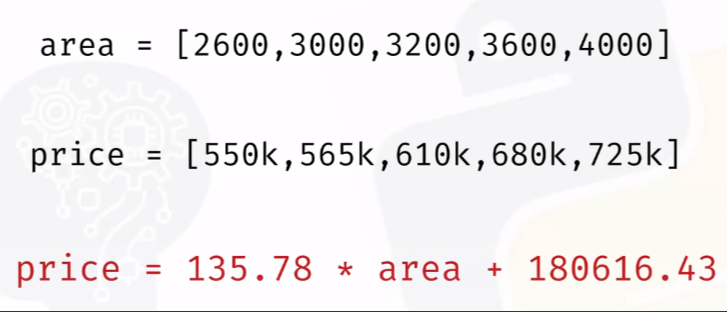

Y = mx +C 
আমাদের ml এ  x and y এর মান দেওয়া থাকে আর আমরা এর থেকে equation টা নির্ণয় করি । এইখানে price এর মান বের করার equation বের করেছি । 

### Area vs price এর scatter plot: 
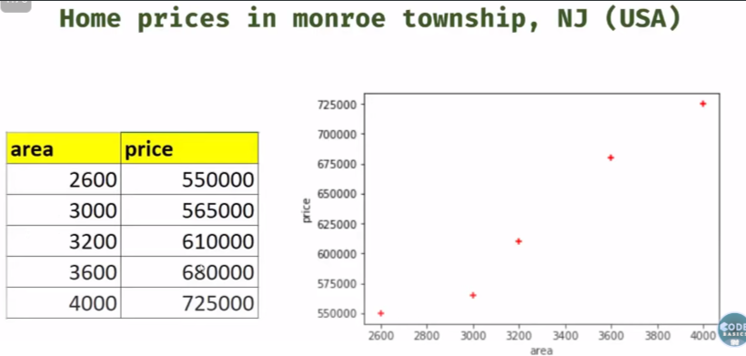

যেহেতু এইটা linear function, তাই এখানে অনেক গুলো লাইন আকা যাবে । এখন এই লাইন গুলোর মধ্যে কোনটা বেস্ট লাইন তা কীভাবে খুঁজে বের করবো ??

বেস্ট লাইন বের করার জন্য আমরা প্রথমে একটা যেকোন লাইন আকবো তারপর, ছবির মত  formula দিয়ে  error calculation করবো । 

এইখানে, উপরের  formula  calculation করার পর যেই value আসে তাকে আমরা বলি mean square error, 

- Y_i actual data point. 
- Y_predicted আমরা যে লাইন বা মডেল বা যেই hypothesis পেলাম সেইটা । 

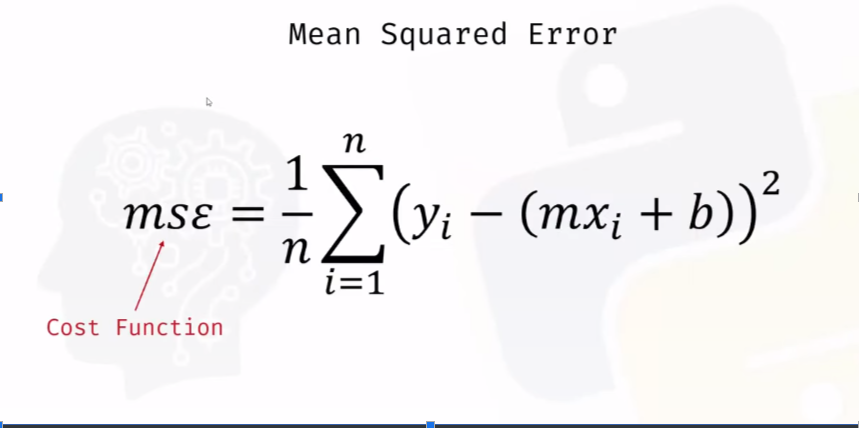

- এই mean square error (with summation) কে আমরা cost function বলি ।
- আর শুধু মাত্র mean square error (without summation কে ) loss function বলি ।  
- Gradient descent হলো একটা optimization algorithrm যেইটা minimize করে loss (loss function) by updating the model parameters (such as weights and biases)। 
- অন্যদিকে, Backpropagation is then employed to compute these gradients or parameter(weights and bias) efficiently by propagating the errors backward through the network, starting from the output layer to the input layer.
`অর্থাৎ, Backpropagation algorithrm এর মধ্যে আমরা Gradient Descent apply করি । `

উপরের গ্রাফে x,y,z axis বরাবর, m,b and mse(mean square error) বিভিন্ন মান বসিয়ে যে গ্রাফ পাই এই গ্রাফের mse সবচেয়ে কম হবে গ্রাফে দেখানো   point টিতে। যেইটা blue লাইনটীকে নির্দেষ করে । এর এইটাই হচ্ছে best fit line.

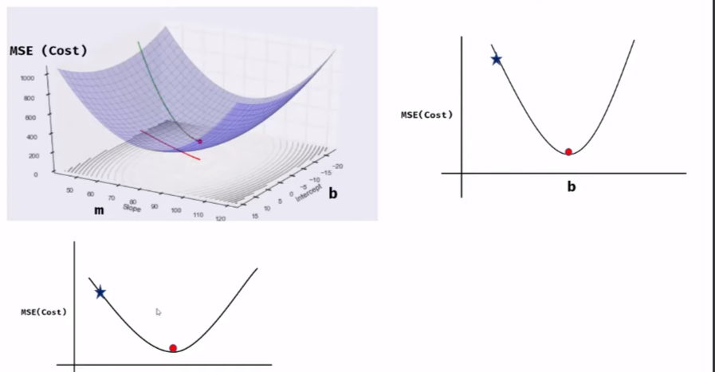

এই গ্রাফ টীকে দুইটা sub-graph এ বিভক্ত করবো  । একবার b যেই লাইন বরাবর আছে সেই লাইন বরাবর গ্রাফটিকে observe করবো আবার, m যেই লাইন বরাবর আছে সেই লাইন বরাবর গ্রাফটিকে observe করবো । 

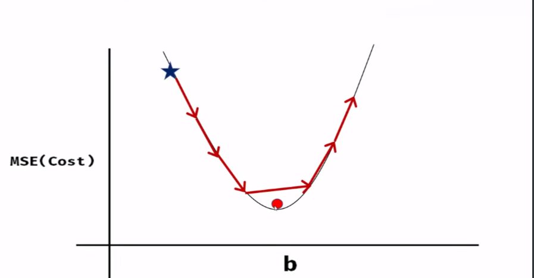

Step এর পরিমান, এখানে star b এর initial value indicate করে । তারপর প্রত্যেক step এ arrow আর পরিমান করে আমরা b এর ভ্যালু decrease করি ।  step এর পরিমান এত বেশি হলে আমরা global minimum miss করে যাবো তাই, আমরা step এর পরিমান আরো অনেক কম করে নিব । 

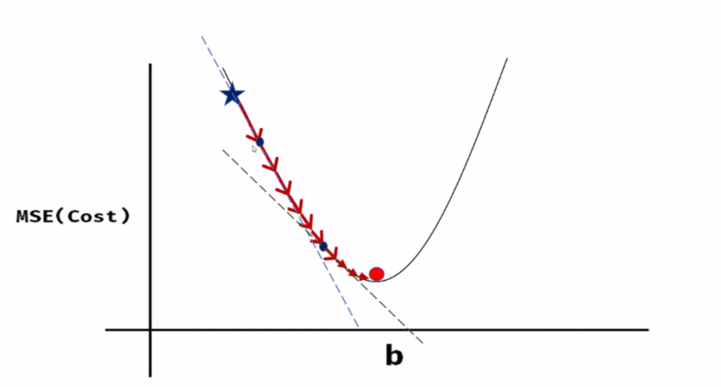

এর জন্য আমরা b এর মান কমানোর সাথে সাথে step এর মান ও কমাতে থাকবো । আমরা যেই  পয়েন্ট এ থাকবো সেই পয়েন্ট বরাবর একটা tangent আঁকবো তারপর এই tangent বরাবর সামনের দিকে যাবো তারপর আর b এর মান কমাতে থাকবো । 

Curve line এ  tangent এর equation কীভাবে বের করবো এর জন্য আমদের partial differentiation সম্পকে জানতে হবে । 

 m and b এর মান কীভাবে বের করবো ??

প্রথমে, m and b এর যেকোন random value ধরে নিয়ে, উপরের formula implement করবো । 

Code:
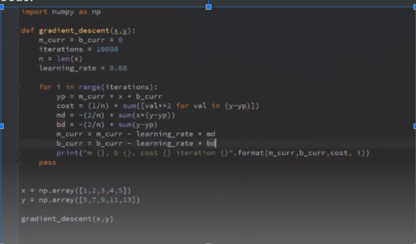

With graph: 

যখন, আমাদের cost তেমন বেশি change হচ্ছে না তখন, আমরা লুপ থেকে বের হয়ে যেতে পারি , math.close() method ব্যবহার করে । 
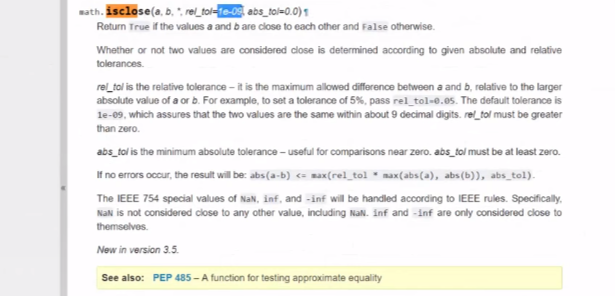

--- 
---

# Stochastic Gradient Descent vs Batch Gradient Descent vs Mini Batch Gradient Descent

## Batch Gradient Descent: 

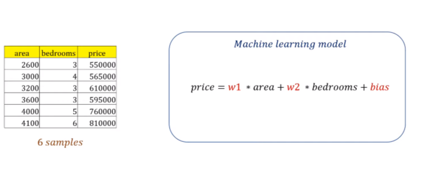

এই  ডাটা সেটের জন্য আমরা, w1,w2 and bias এর মান বের করবো । এর জন্য আমরা, 
শুরুতে, w1,w2 and bias = 1 ধরবো,  

তারপর, প্রথম row এর জন্য model  অনুযায়ী আমরা  error1 এইভাবে, error6 পর্যন্ত calculate করবো । একে বলে epoch যেহেতু এইটা 1st epoch তাই আমরা একে end of first epoch বলবো ।  

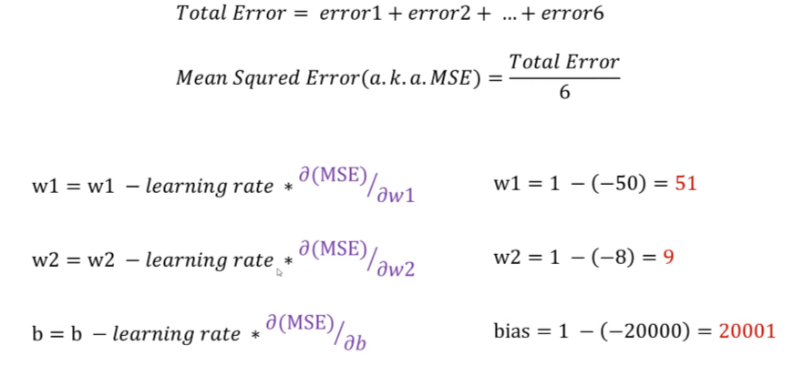

প্রথম,epoch শেষ হলে আমরা mean square error calculation করে নতুন weight1, weight2 and bias এর মান adjust করবো। 
এইভাবে আমরা best fit line বা model বের করবো । 

যে gradient descent এ আমরা সকল training sample এর error calculate করি তাকে batch gradient descent বলে । 

 

## Stochastic Gradient Descent: 

এখন, যদি আমাদের কাছে 10 million data থাকে সেক্ষেত্রে তো আর সব গুলো training sample এর error calculation করা possible না । আর 10 million data এর জন্য আমদের 20 million বার partial derivative করতে  হবে সেইটা computation expensive। deep learning এও এর ব্যবহার আছে । এত  বড় calculation করা আমাদের কম্পিউটারের পক্ষে সম্ভব নয় । তাই আমরা , যেকোন একটা  random sample কে সিলেক্ট করি তারপর সেইখানে gradient descent apply করি । একে আমরা বলি stochastic gradient descent . 

Difference between batch gradient and stochastic gradient descent: 
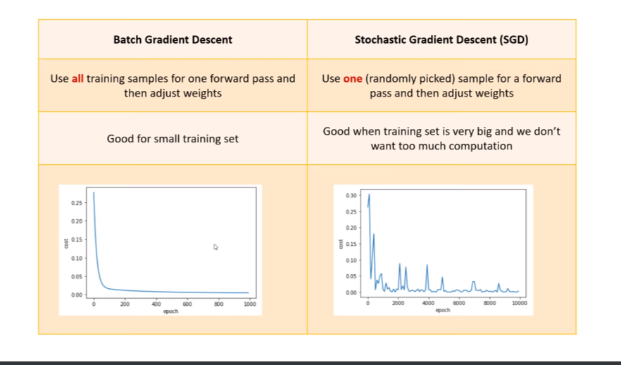

## Mini-batch gradient descent: 

এটা SGD এর মতোই কিন্তু আমরা একটা randomly sample select করার পরিবর্তে আমরা বেশ কয়েকটি sample ব্যবহার করি । 

     

----

# In Deep Learning:

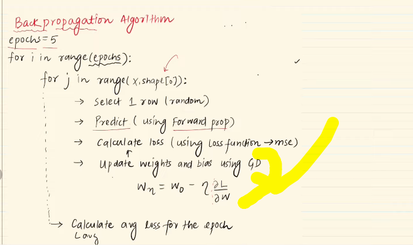

 

---

---

#### Here are the names of different types of gradient descent algorithms:

1. Batch Gradient Descent
2. Stochastic Gradient Descent (SGD)
3. Mini-batch Gradient Descent
4. Gradient Descent with Momentum
5. AdaGrad
6. RMSProp (Root Mean Square Propagation)
7. Adam (Adaptive Moment Estimation)

 
 

---

# Batch Gradient Descent:

`এখানে আমরা একটা লুপই চালাই যেইটা শুধু  epoch এর জন্যই চলবে ।  `

# Difference between `Batch` and `Stochastic` Gradient Descent

 

# Which is faster(given same number of epochs)?

`Batch Gradient Descent` is faster than stocastic gradient descent.

- batch size: 1 হলে সেইটা stochastic gradient descent । 

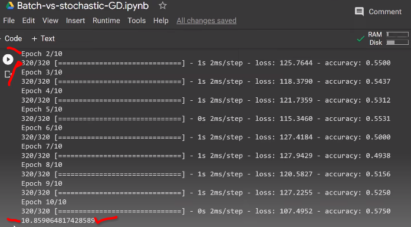

`batch_size=320, একটা রো এর ৩২০ টা batch বানাও । প্রত্যেক epoch এ 320 বার weight and bias update হচ্ছে `

- batch size: row_size(320) হলে সেইটা batch gradient descent । 

`batch_size=320, একটায় batch বানাও যেখানে টা রো আছে । প্রত্যেক epoch এ 1 বার weight and bias update হচ্ছে ` 

   

# Which is the faster to converge (given some epoch)

`- this time it is stochastic gradient descent.`

কারণ, stochastic gradient descent আর Batch Gradient Descent এ সেম epoch এ রান করলেও stochastic gradient descent এ weight and bias update বেশি হচ্ছে একটা single epoch । তাই converge বেশি হবে । 

# loss function reduction in `batch is stable` but in `stochastic is unstable`

 

`Graph in: Batch`

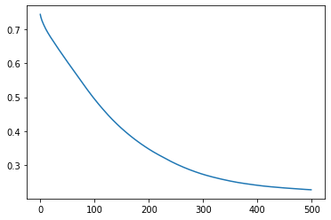

- **stable**

`Graph in: Stochastic`

- **unstable**

---

# কেন এমন হয় `why stable and unstable`?

- **SGD এ আমরা randomly একটা data point pick করি তাই জিগজাগ লাইন পাচ্ছি**
- **আমরা সব গুলো রো এর মধ্য দিয়ে একটা organized way তে**

# SGD `এর spikey behaviour কি useful`?

- **YES**

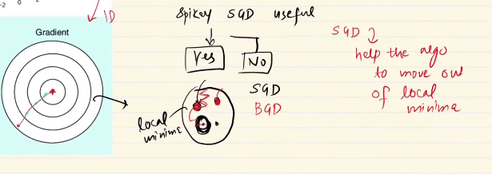

যদি আমাদের অনেকগুলো minima থাকে তাহলে, batch gradient descent এর ক্ষেত্রে, local minima তে আঁকটে থাকতে পারে কারণ batch gradient descent এর ক্ষেত্রে organized way তে data flow হয় । অন্যদিকে, SGD তে তারা যদি কোন local minima তে আঁকটে যায়, জিগজাগ characteristic এর কারণে তারা সেই থেকে বেরিয়ে এসে global minima(সবচেয়ে বড় গোলাটা) কেই আউটপুট হিসেবে দেয় । 

   

- **NO**

জিগজাগ behavior এর কারণে, আমরা exact global minima টা পায় না  appoximately, global minima এর কাছাকাছি কোন ভ্যালু পাই ।

    

---

# Vectorization:

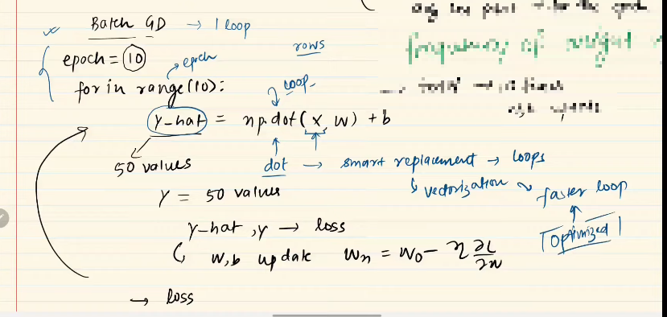

এখানে, y_hat এর জন্য আমাদের আর একটা লুপের দরকার ছিল কিন্তু আমরা ওইটা  np.dot() দিয়ে করে ফেলেছি । এইটা লুপের থেকে faster and optimized । আর একেই Vectorization বলে । 

এখন আমাদের কাছে যদি কোন বড় ডাটাসেট থাকে তাহলে, যেমনঃ ১০ কোটি রো এর সেক্ষেত্রে এত গুলো ডাটা আমাদের র‍্যাম এ লোড হতে পারেবে না । তাই এক্ষেত্রে Vectorization কাজ করবে না । 

---

# Mini batch Gradient Descent:

BGD and SGD এদের দুইজনের সুবিধা আর অ্যাসুবিধা আছে । এদের দুইজনের থেকে একটি ভালো Gradient Descent হলো Mini batch Gradient Descent । ৩২০ টা রো থাকলে এদের ৩২ টাকে  নিয়ে একটি batch বানালে টোটাল ১০ টা বানাবো যাবে । অর্থাৎ, প্রতেক ephoc এ ১০ বার update হবে । 

i) প্রথম অসমটা  টি হচ্ছে, কোন টা কত ফাস্ট ।  
i) দ্বিতীয় অসমটা  টী হচ্ছে, `Convergence Rate` কার কতো বেশি । 

---

# Question:

কেন  batch size দুই এর গুনিতক হিসেবে দেওয়া হয় ?? 

` র‍্যাম কে efficiently ব্যবহার করতে পারে যদি সেইটা দুই এর গুনিতক হিসেবে দেওয়া হয়।`

