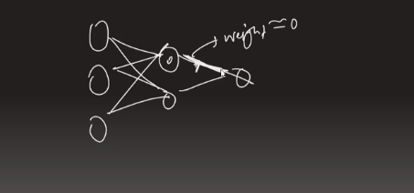
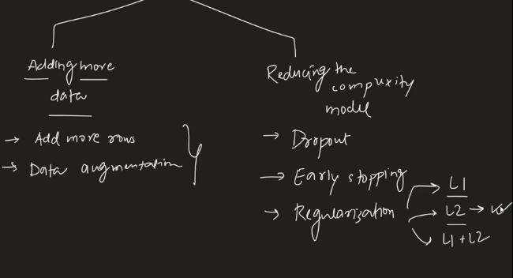

---

# Regularization 

---

`আমাদের মডেল যদি overfit করে তাহলে আমরা Regularization ব্যবহার করে সেইটা থেকে মুক্ত হতে পারি । `

# Why Neural Network Overfit?

`আমরা যখন একটা Neural Network এ একটা node রাখি তখন সেইটা আমাদের একটা line draw করে দেয় শুধু । আমরা Neural Network যদি Neural Network এ node বা hidden layer বাড়াতে থাকি তাহলে আমাদের সেই line তত  বেশি curve হতে থাকে । আর আমাদের training data এর minor point গুলোও capture করতে থাকে।  `

` overfitting এর সমস্যা দুর করার জন্য আমরা node কমাতে পারি । node কমাতে হলে আমাদের সেই node weight বা  piority কে আমরা শূন্য এর কাছাকাছি নিয়ে যাবো । `

# How to solve overfitting problem:

# How regularization work?

`আমরা Neural Network অথবা ANN এ weight and bias এর মান বের করি cost function এর মান reduce করার মাধ্যমে ।  আর regularization এ আমরা cost function এর সাথে একটা penalty add করে দেয় । L2 Regularization এর ক্ষেত্রে আমরা উপরের equation টি penalty এর মান এর সমান হিসেবে বসায়। এখানে, লেমডা হচ্ছে, hyperparameter । লেমডা এর মান বাড়ালে আমরা overfitting থকে underfitting এর দিকে চলে যায় ।  `

`penalty এর কাজ হচ্ছে আমাদের Neural Network এর weight গুলোর মান কে 0 এর  দিকে নিয়ে আসে । `

` L1 এর ক্ষেত্রে শুধু  square টা হবে না ।  `

` আবার অনেক জায়গায় আমরা সমীকরণটি নিচের মতো দেখতে পাবো । `

`যেখানে, penalty এর equation এ l বলতে বুঝায় আমরা কোন layer এ আছি । তারপর, i আর j দিয়ে বুঝায়  Neural Network এর (i-তম column, j-তম row ) এর node । `

