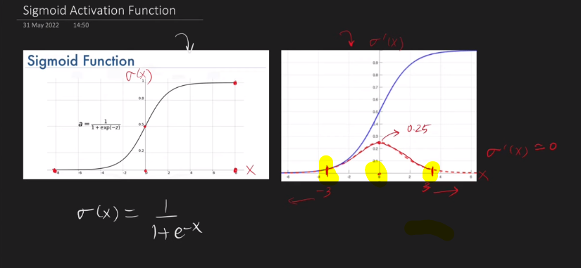
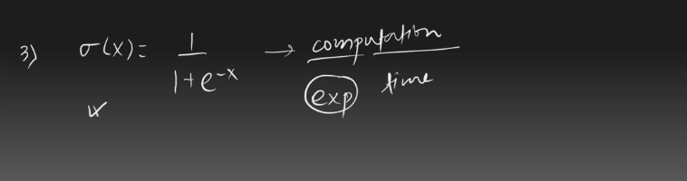

---

# Activation Function:

---

# What is activation function:

`Activation function হচ্ছে input এবং output এর মধ্যে একটা gate । যেইটা করে একটা neuron active হবে নাকি হবে না। `

---

# Why activation function is important ? 

`Activation Function না ব্যবহার করলে আমরা non-linear data কে capture করতে পারবে না । Linear Activation Function এর ক্ষেত্রে f(x) = x হয় । `

### see code example:

---

# Ideal Activation Function:

- `Activation function should be non-linear: এটা না হলে আমরা  non-linear data কে capture করতে পারবে না । `

- `Activation function should be Differentiable: কারণ আমরা gradient descent ব্যবহার করি । `

- `Should be Computationally inexpensive: differentiation এত complex হবে না যেইটা করতে অনেক বেশি সময় লাগবে । Computationally expensive হলে, আমাদের train এর সময় অনেক বেশি লাগবে ।  `

- `Should be zero centered or nomalize: আমরা train এর সময় normalized data দিলে সেইটা খুব তাড়াতাড়ি converge হবে । example: tanh activation funciton. `

- `Should be non-saturating: এরা একটা ইনপুট কে একটা range  এর মধ্যে আবন্ধ করে । যেমনঃ sigmoid range(0~1) or tanh range(-1,1) . Saturating activation function হচ্ছে relu, max(o,x) । non-sturating activation function এর ক্ষেত্রে vanising gradient descent দেখা দেওয়ার  probability অনেক বেশি । `

---

# Sigmoid Activation Function:

` বামের ছবির গ্রাফ হলো Sigmoid Activation Function  এর  আর ডানের ছবির গ্রাফ হলো Sigmoid Activation Function এর Derivative এর । Derivative এর গ্রাফে, x এর মান শূন্য হলে Derivative এর মান সবচেয়ে বেশি হয় আর Derivative এর মান -3 থেকে 3 এর মধ্যেই revolve করতেছে । `

## Advantage of Sigmoid Activation Function:

## Disadvantage of Sigmoid Activation Function:

- ` সবচেয়ে বড় সমস্যা হচ্ছে, Sigmoid Activation Function এ vanishing gradient descent এর সমস্যা দেখা দেয় । অনেক সময় x এর মান অনেক বড় হয় যার ফলে এর differentiation ছোট হয় । উপরের ছবিতে যেমন আমরা দেখেছিলাম Sigmoid Activation Function এর Derivative এর গ্রাফ (-3 থেকে 3 ) এর মধ্যে থাকে যদি এই বাইরে চলে যায় তখন  y axis এর ভ্যালু গুলো শূন্য হয় । ভ্যালু শুন্য হলে, Wnew = Wold - (learning_rate * dL/dWold) , Wnew এর মানে কোন পরিবর্তন আসে না । তাই,vanishing gradient descent প্রবলেমের দেখা দেয় । এই সমস্যার জন এখন পযন্ত শুধু binary classification problem এর output layer ছাড়া  অন্য কোথাও Sigmoid Activation Function ব্যবহার করা হয় না ।  `

- `Sigmoid Activation Function হলো non-zero centered: যেইখানে সবকিছু পজিটিভ বা নেগিটিভ কিন্তু শূন্য না এইসব ক্ষেত্রে আমরা যখন loss calculation করি তখন time বেশি লাগে আর convergence rate ও বেশি হয় । `

- `Computationally Expensive: Calculation করতে সময় বেশি লাগে ।  `

---

# tanh Activation Function:

