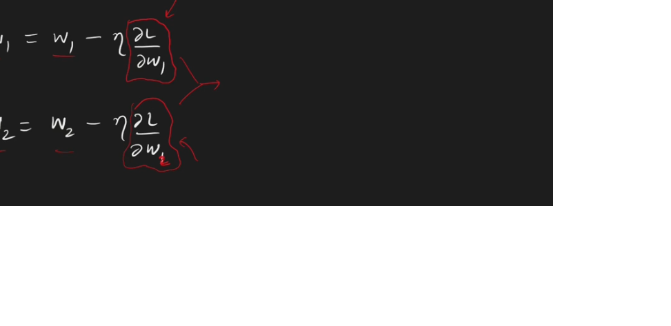
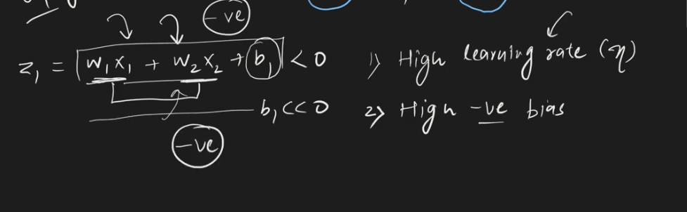
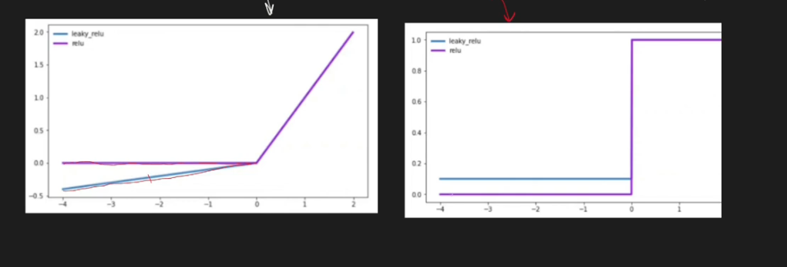

---

# (ReLU) and its some problem and variants

---

### `Rectified Linear unit (ReLU)`

# Dying Relu Porblem:

`অনেক সময় আমরা activation function হিসেবে relu দিলে output zero হয়ে যায় । এইসব neuron কে dead neuron বলে । আর যদি আমাদের neural network এ 50% এর বেশি dead neuron থাকে তাহলে সেইটা non-linear property কে capture করতে পারে না । আর এই সমস্যাকে Dying Relu Porblem বলে । Worst case, 50% neuron dead হয়ে যেতে পারে সেইক্ষেত্রে আমাদের neural network কোন কাজেই আসবে না ।  `

## Why daying Relu Problem Occur:

`উপরের ছবির neural network এ আমরা activation function হিসেবে relu ব্যবহার করেছি। মাঝের hidden layer  এর weighted sum যদি negative হয় তাহলে আমরা relu এর আউটপুট হিসেবে 0 পাবো ।  `

`আর final output নির্নয়ের ক্ষেত্রে আমাদের differentiation করতে হয় বা আমরা gradient descent ব্যবহার করি । এ ক্ষেত্রে আমাদের output শূন্য আছে । আর আমাদের weight এর ভ্যালু update হয় না । তখন আমরা যেই neuron কে dead nueron বলি । সব কিছুর মূলে রয়েছে weighted sum এবং যখন সেইটা negative হয় । `

## weighted sum কখন negative হয় ?? 

- `**High Learning Rate:** বেশি হলে differentiation(Gradient Descent) করার পর এর সাথে Learning Rate গুন দিলে একটা বড় +Ve মান পাবো । আর সেই বড় +Ve মান থেকে W_old এর ভ্যালু থেকে minus করলে আমরা একটা  negative value পাবো, যার ফলে আমারা Dying Relu Porblem এ পড়ে যাবো । `

- `**High -Ve Bias:** যদি আমাদের Bias অনেক -Ve হয়ে যায় তাহলে সেক্ষেত্রেও আমরা Dying Relu Porblem এ পড়ে যাবো। `

 

` আর যদি কোন neuron একবার dead neuron এ পরিণত হয় তাহলে আর তার recover করা সম্ভব নয় ।  `
 
 

# How to get rid from daying Relu Problem?

- `Set positive value of bias.`
- `Instead of relu use the variants of relu.`

# Variants of relu:
- `Linear :  i) Leaky Relu  ii) Parametric Relu `
- `Non Linear : i) ELU (Exponential linear unit) ii) SELU (Scaled Exponential linear unit) . `

# Leaky Relu:

` max(0.01z,z) 0.01z or ( 1/100 * z ) থাকার কারণে daying Relu prblem দেখা যায় না । আগে যেখানে, zero থাকার কারণে weight এ কোন change হচ্ছিলো না এখন সেইখানে অল্প কিছু হবে । `

`বাম পাশের গ্রাফটি হচ্ছে Relu and Reaky Relu  এর গ্রাফ । আর ডান পাশের, graph of derivative of Relu and Reaky Relu । `

# Advantage of Reaky Relu:

### In Reaky Relu why 0.01z ? 

# Parametric Relu:

`Reaky Relu এর মতোয় কিন্তু আগে যেখানে 0.01 নিয়ে ছিলাম সেখানে নিজের ইচ্ছের মতো ভ্যালু নিতে পারি যেইটা আলফা দিয়ে দেখানো হয়েছে । এর জন্য আমরা একটা fexibility পায় । এছাড়া বাকী সব কিছু একদম Reaky Relu এর মতোয় । `

# Elu - Exponential Linear Unit:

`x<0 শূন্যের থেকে ছোট হলে `
