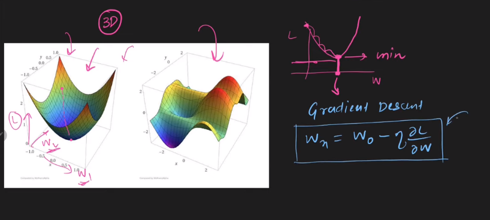
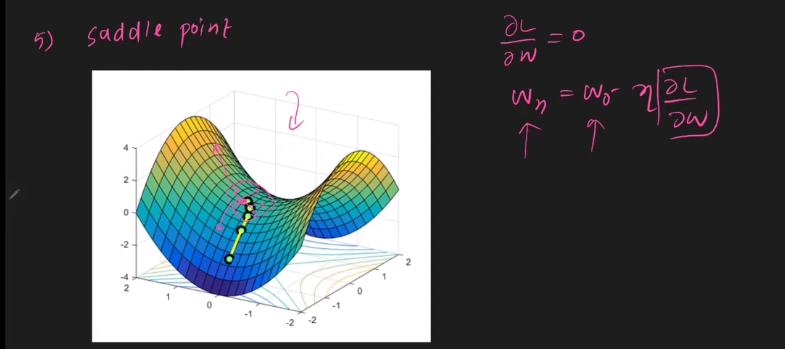

---

# Optimizers in Deep Learning

---

` কীভাবে আমাদের neural network traning speed up করা যায় এর জন্য আমরা ঃ i) weight initialization ii) Batch Normalization iii) Activation function  দেখেছি । আর আজকে থেকে আরেকটা neural network traning speed up করা যায় এমন একটা technique দেখবো ।  `

# Role of Optimizers:

`neural network এ আমরা weight and bias এর সঠিক ভ্যালু টা খুঁজে বের করার চেষ্টা করি । শুরুতে আমরা randomly weight and bias এর একটা ভ্যালু নেই । তারপর, predicted value এর সাথে real value এর loss আমরা calculation করি । আর এইকে reduce আর weight and bias কে update করার মাধ্যমে আমরা সঠিক weight and bias এর value পাই । অর্থাৎ,neural network একটা Optimizers এর এখানে Optimizers হিসেবে কাজ করে gradient descent . `

# Types of Optimizers:

1. **Batch Gradient Descent (BGD)**:

2. **Stochastic Gradient Descent (SGD)**:

3. **Mini-batch Gradient Descent**:
   
`আমরা উপরের Optimizer গুলো পড়েছি । আর এদের কিছু সমস্যা আছে । তাই আমরা কিছু নতুন Optimizer শিখবো । `

# Challenges in an Optimizers:

i) **Learning rate:** এর সঠিক মান বের করা । 

ii) **Learning rate scheduling:** Learning rate এর সঠিক মান বের করার জন্য আমরা Learning rate scheduling ব্যবহার করি । কিন্তু, এইটা model training এর আগে decide করতে হয় কত গুলো epoch এর পর learning rate এর মান change করা শুরু হবে আর কত করে । তাই একই মান দিয়ে প্রত্যেক model এ optimam learning rate এর value পাওয়া যায় না  । 

iii) **Multiple Value Of convergence:** একটা neural network আমরা তো অনেক গুলো weight and bias এর মান বের করে থাকি । graph এর visulization এ ধরি আমরা weight dএর মান বের করবো সেক্ষেত্রে আমরা একদিকে w1,অন্যদিকে, w2 দেই । কিন্তু আমাদের এমন হতে পারে যে, w1 এর থেকে w2 এর দিকে  learning rate একটু কম দিলে w2 এর convergence ভালো হবে । কিন্তু আমরা একের অধিক learning rate দিতে ব্যবহার করতে পারি না । 

iv) **Global Minima:** আমাদের সেই visulization graph এ একাধিক local minima থাকতে পারে । কিন্তু, আমাদের তো সবচেয়ে ছোট যেই local minima বা global minima সেইটা তে পৌছতে হবে । অনেক সময় আমরা local minima তেই পড়ে থাকি global minima তে যেতে পারি না । SGD তে local এ ফেঁসে গেলে সেইখান থেকে global এ যেতে পারে কিন্তু probability খুব কম আর বাকি দুটো batch and mini-batch gradient descent তেমন ভাবে local এ ফেঁসে গেলে skip করতে পারে না । 

v) **saddle Point:** Saddle point হচ্ছে এমন একটা point যেখানে, একটা dimention এর slope উপরের দিকে অন্য একটা dimention এর slope নিচের দিকে যাচ্ছে । এতে, এমন একটা region তৈরি হয় যেখানে, slope চারদিকেই যাচ্ছে এসব ক্ষেত্রে differentiation শূন্য হয়, ফলে traning বন্ধ হয়ে wight and bias এর একটা value বের হয় কিন্তু এইটা আমাদের optimam solution না । 

`উপরের সমস্যা গুলোর জন্য আমাদের new কিছু Optimizers শিখতে হবে । ` 

