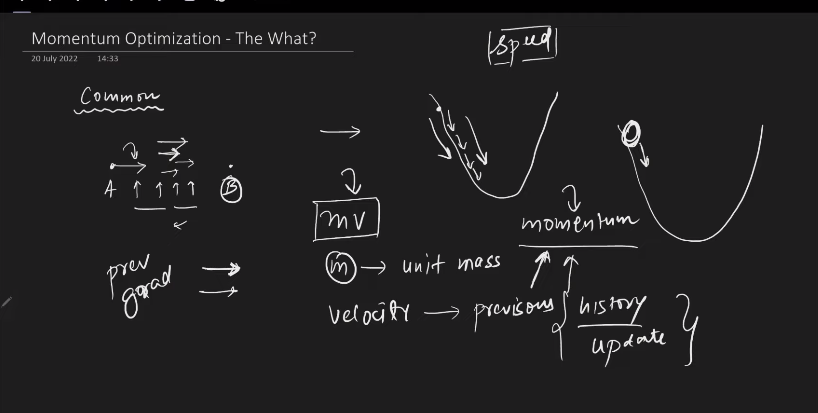
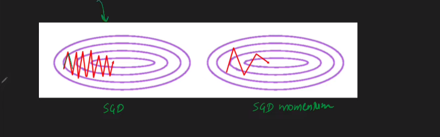

---

# SGD With Momentum:

---

# `First we learn some Basic: `

### Understanding Graphs:

`2D,3D and Contour Plot.`

`আমরা জানি, neural network এ weight and bias এর সঠিক মান বের করার বা Loss কে কম করার জন্য আমরা Loss function ব্যবহার করি । আমরা যেমনঃ Math এ কোন function দেওয়া থাকলে আমরা তার আঁকতে পারি, তেমন ভাবে আমরা Loss function  এর গ্রাফ আঁকলে উপরের গ্রাফ গুলো পাবো । আমরা জানি, Loss Function একটা nueral network যতগুলো parameter(weight+bias) থাকে তাদের উপর নির্ভর করে । এখন আমাদের কাছে কোন একটা nueral network এ যদি (15 weight  আর 10 bias থাকে) তাহলে তার গ্রাফ হবে 25D । কিন্তু সমস্যা হচ্ছে, মানুষ 3D বা এর কম dimention ছাড়া কোন কিছু ভালো করে observe করতে পারে না । তাই আমাদের দরকার Contour Plot । উপরের 3D  Plot কে Contour Plot represent করেছি । `

- `2D তে একটা axis এ Loss অন্য একটা  axis weight (assuming that, we have only one weight and no bias.)`

- `3D তে একটা axis এ Loss অন্য একটা  axis weight আর অন্য একটা  axis এ bias। `

   
# Contour Plot Examples:

` আমরা যেহেতু higer dimention থেকে lower dimention যচ্ছি তাই আমরা অনেক গুলো dimention হারিয়ে ফেলছি সেইগুলোকে আমরা color এর মাধ্যমে represent করতেছি contour graph এ । যেমনঃ উপরের ছবিতে yello color যেইটা একটু উপরের দিকে আছে । আর purple color একটু নিচের দিকে আছে ।  `

     

# Convex vs Non-Convex:

`আমাদের loss function এর গ্রাফে যদি একটা minima থাকে তাহলে সেইটা কে গ্রাফ Convex বলে । আর যদি একাধিক minima  থাকে (local+global) তাহলে সেইটা কে non-convex গ্রাফ বলে । একটা non-convex গ্রাফে এ saddle point(আগে দেখেছি),local minima, global minima আর high curvature থাকতে পারে । `

`**High Curvature:** উপরের ছবিতে দুইটা বৃত্ত আছে । এখন, বড় বৃত্তটির radius বড় আর ছোট বৃত্তটির radius ছোট । যার radius বড় তার curvature ছোট আর যার radius ছোট তার curvature বড় । বড় curvature গুলো  traverse  করা কষ্টকর। এই সমস্যা গুলোর জন্য আমাদের SGD,BGD,mini-BGD ভালো করে solve করতে পারে না । তাই আমাদের optimizer এর দরকার হয় । `

# Momentum Optimization

`Non-convex এর ক্ষেত্রে আমরা যেই সমস্যা গুলো ফেইস গুলো সব গুলোকে Momentum Optimizer solve করতে পারে । `

`momentum optimization বলতে বুঝি, আমাদের আগের gradient যদি আমাদের সামনের দিকে যেতে বলে তাহলে আমরা সামনের দিকে যাবো । অর্থাৎ, এইটা একটা curve surface এ curve surface এর উপর থেকে কোন একটা বল গড়িয়ে পড়ার মতো তাই এই optimization এর নাম হচ্ছে momentum optimizer  । আমরা জানি, momentum = mass * velocity . আমরা একটা unit mass ধরে পূর্বের gradient থেকে velocity calculate করি । `

`আমরা Exponentially Weighted Moving Average এর সাহায্য নিয়ে velocity calculate করি । ফর্মুলা V_t দিয়ে দেখানো হয়েছে আর এই ক্ষেত্রে আমরা Weighte calculate করি ডানপাশের W_t+1 formula দিয়ে । আমরা দেখতে পাচ্ছি যে, এ velocity আগের velocity এর উপর নির্ভর করতেছে ।`

`See the benifit of using SGD with momentum . Traning সময় SGD এর থেকে অনেক কম লাগবে ।  `

# Effect of beta:

`যদি beta = ০ হয় তাহলে, Momemtum SGD সাধারণ SGD এর equal হয় । beta কে Decaying Factor বলা হয় । যদি beta = ১ হয় তাহলে,  নিচের চিত্রের মতো দেখাবেঃ `

`এখানে ছোট একটা বলের মতো দেখাছে সেইটাই আমাদের desire পয়েন্ট এ যাবে । যদি beta = 1 হয় তাহলে বলটি dynamic equilibrium চলে যাবে ।  অর্থাৎ, বলটি একপাশে থেকে অন্যপাশে move করবে শুধু । `

