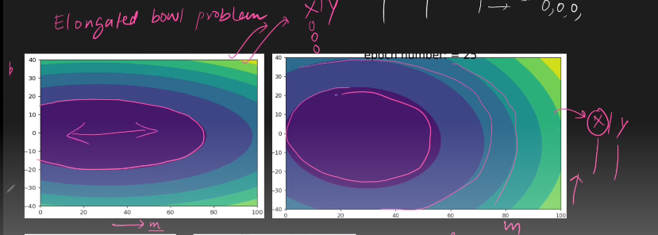
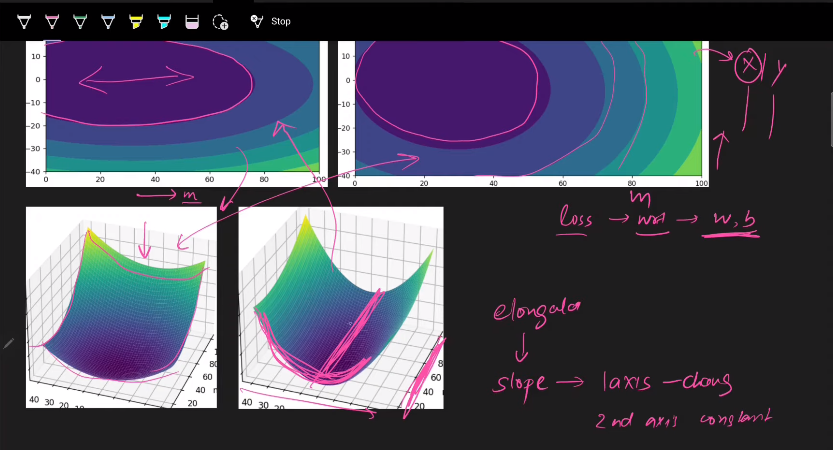
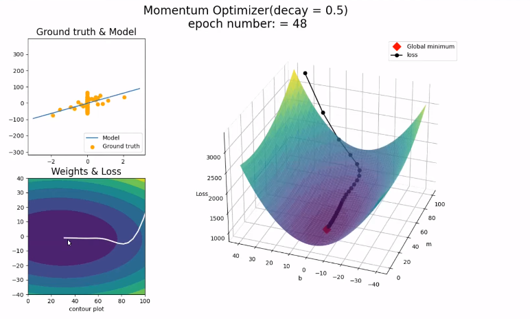
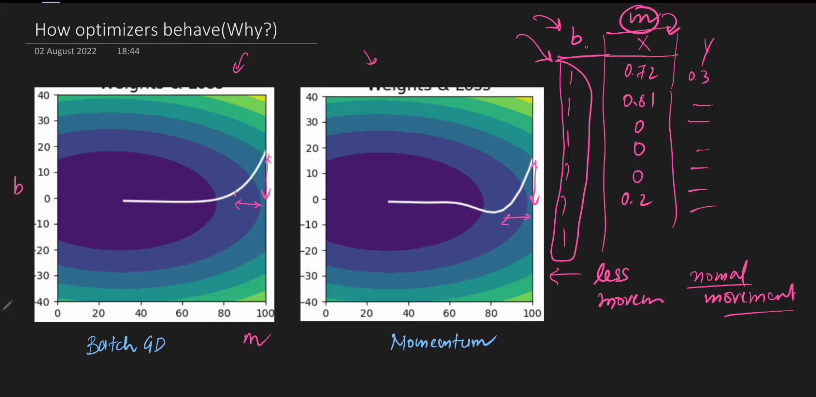

---

#  AdaGrad (Adaptive Gradient Algorithm)

---

`AdaGrad-> Adaptive Gradient । সময়ের সাথে সাথে learning rate change হয় বা learning rate নিজেকে adopt করে । AdaGrad আমরা ব্যবহার করবোঃ `

- `i)  যদি আমাদের Input Feature scale different  হয় । Generally, আমরা ডাটাকে Normalize or Scaling (In scaling, you're changing the range of your data, while. in normalization, you're changing the shape of the distribution of your data) করি ML or Dl Algorithrm করার আগে । সেক্ষত্রে, AdaGrad ভালো perform করে না ।  `

- `ii) আমাদের feature এ যদি অনেক sparse value  থাকে । In our dataset for a particular column(from IIT) most of the value is zero । `

#### `Feature, sparse  হলে Elongated Bowl Problem  দেখা দেয় । `

`Feature, sparse হলে আমাদের contour plot, circle এর পরির্বতে একটু ellipse আকারের হয়ে থাকে। `

`উপরের ছবি গুলো 3D । আমাদের ডাটাসেটে এমন ভ্যালু হলে এক axis এ solpe change হয় অন্য axis এ solpe change হয় না। এই সমস্যাকে solve করে AdaGrad । `

### Let's see BGD, Momentum Optimization, NAG এ কি প্রবলেম হচ্ছে । 

` (BGD) `

`Momentum Optimizer (decay = 0.5 )`

### ` দুই ক্ষেত্রে, contour plot দেখলে আমরা বুঝতে পারবো আমাদের এর থেকে optimize way খুঁজে বের করা সম্ভব । `

`M তে sparse value আছে আর B তে নেই তেমন । শুরুতে, যেইদিকে( M  তে ) sparse value আছে সেইদিকের axis এ solpe change হয় না তেমন । কিন্তু, শুরুতে, যেইদিকে( B  তে ) sparse value নেই সেইদিকের axis এ solpe change হয়েছে অনেক। `

`Sparse data থাকার কারণে, BGD এর ক্ষেত্রে differentiation করলে অনেক বার শূন্যের কাছাকাছি মান আসবে । অন্যদিকে, bias এর ক্ষেত্রে তা হবে না তাই bias update অনেক বেশি হবে ।  `

# Mathematical Intution (AdaGrad):

`আমরা দেখলাম যে, Sparse data থাকার কারণে, একটার differentiation অনেক ছোট হয় আর আরেকপাশের differentiation অনেক বড় হয় । এই সমস্যার সমাধান করে AdaGrad । কারণ, AdaGrad এ learning rate change হয় । যখন আমাদের derivative অনেক বড় হয় তখন learning rate ছোট হয়, আবার যখন, আমাদের derivative ছোট হয় তখন আমাদের learning rate বড় হয় । এইভাবে AdaGrad, learning rate change করার মাধ্যমে Sparse data থাকার কারণে যে সমস্যা হয় তার সমাধান করে । `

`Actually, Formula.  `

# Disadvantage of Adagrad:

`AdaGrad কে আমরা একটা নাম্বার v_t(exponentially weighted moving average) দিয়ে ভাগ দেই । আমরা যত global minima এর দিকে যায় তত v_t এর মান বাড়তে থাকে ফলে learning rate কমতে থাকে, Weight update এর পরিমাণ ও ধীরে ধীরে কমতে থাকে । `

---

`RMSProp, Adam Optimizer পড়বো সেখানে, Adagrad এর concept কাজে লাগবে । `

---

