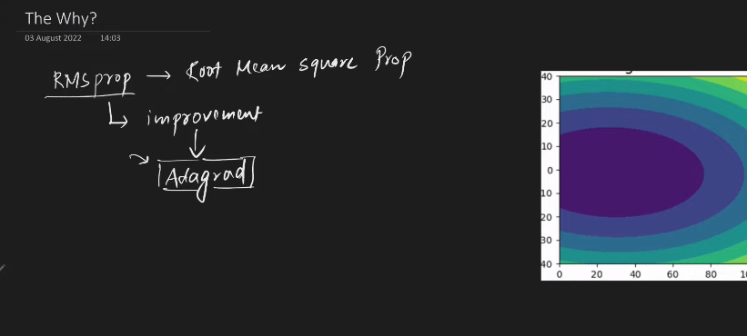
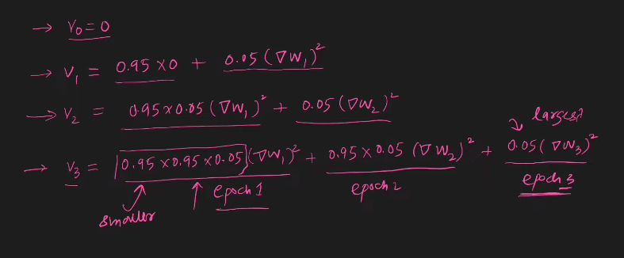

---

# RMSProp (Root Mean Squared Propagation.)

---

### `RMSProp হচ্ছে Improvement of AdaGrad`

`AdaGrad আমরা যত global minima এর দিকে যায় তত v_t এর মান বাড়তে থাকে(V_t calculation এর সময় আমরা আগের V_t এর সাথে সাথে Loss function এর square যোগ করি তাই সময়ের সাথে সাথে v_t বাড়ে) ।`

`উপরের সমস্যাটির সমাধান হিসেবে আমরা v_t এর formula change করি । এই formula তে আমরা আমাদের past epoch কে  কম ভ্যালু দেয় আর present epoch গুলোকে সবচেয়ে বেশি ভ্যালু দেই । `

`উপরের, calculation থেকে আমরা বলতে পারি, 1st epoch এর value সবচেয়ে কম তারপর  2nd epoch এর value আর একটু বেশি আর সবচেয়ে বেশি হচ্ছে  3rd epoch এর value । `

