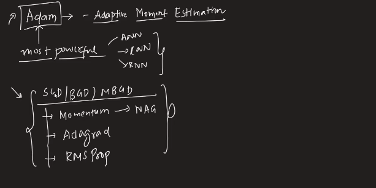
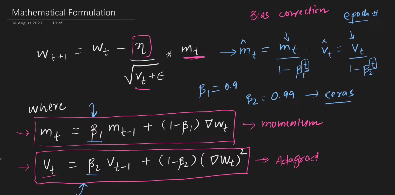

---

# Adam Optimizer:

---

`Adam কে বুঝার জন্য আমরা আগে যেই optimizer গুলো পড়েছি সবগুলোর Basic ভালো ভাবে Clear থাকতে হবে । Momentum Optimizer and NAG হচ্ছে Momentum এর concept based । AdaGrad and RMSProp হচ্ছে learning decay এর concept based। Adam হচ্ছে Momentum আর learning decay এর concept কে merge করে তৈরি । `

# Mathematical Intution of Adam:

`Bias correction t epoch number . Generally, Beta_1 = 0.9 and Beta_2 = 0.99 । Learning rate = 0.1 or 0.01 change learning decay এর concept কে merge করে learning rate adoptable । `

# UseCase:

`আমরা অনেক optimizer গুলো পড়লাম, এর মধ্যে  সর্বপ্রথম দেখবে যে, Adam  কেমন performance করে তারপর  RMSProp কেমন performance করে তারপর momentum কেমন performance করে ।  Hyperparameter Tuning দিয়ে চেক করবো কোন optimizer টা ভালো কাজ করতেছে । `

