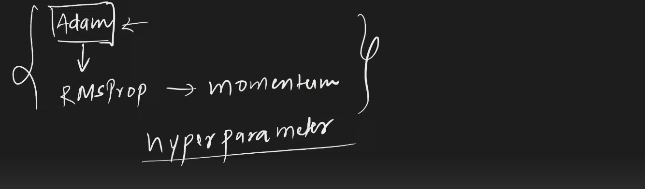

---

# Adam Optimizer:

---


`Adam কে বুঝার জন্য আমরা আগে যেই optimizer গুলো পড়েছি সবগুলোর Basic ভালো ভাবে Clear থাকতে হবে । Momentum Optimizer and NAG হচ্ছে Momentum এর concept based । AdaGrad and RMSProp হচ্ছে learning decay এর concept based। Adam হচ্ছে Momentum আর learning decay এর concept কে merge করে তৈরি । `

# Mathematical Intution of Adam:


`Bias correction t epoch number . Generally, Beta_1 = 0.9 and Beta_2 = 0.99 । Learning rate = 0.1 or 0.01 change learning decay এর concept কে merge করে learning rate adoptable । `

# UseCase:



`আমরা অনেক optimizer গুলো পড়লাম, এর মধ্যে  সর্বপ্রথম দেখবে যে, Adam  কেমন performance করে তারপর  RMSProp কেমন performance করে তারপর momentum কেমন performance করে ।  Hyperparameter Tuning দিয়ে চেক করবো কোন optimizer টা ভালো কাজ করতেছে । `


<br>
<br>
<br>

---

# code example: 

Certainly! Here are the implementations of various optimizers in TensorFlow and Keras for deep learning, rewritten to follow the specified format:

### i) Stochastic Gradient Descent (SGD)
```python
import tensorflow as tf

# Define loss and optimizer
loss = tf.keras.losses.SparseCategoricalCrossentropy()
optimizer = tf.keras.optimizers.SGD(learning_rate=0.01)

# Compile the model
model.compile(loss=loss, optimizer=optimizer, metrics=['accuracy'])
```

### ii) Batch Gradient Descent
Batch Gradient Descent is achieved by setting the batch size equal to the size of your dataset.
```python
import tensorflow as tf

# Define loss and optimizer
loss = tf.keras.losses.SparseCategoricalCrossentropy()
optimizer = tf.keras.optimizers.SGD(learning_rate=0.01)

# Compile the model
model.compile(loss=loss, optimizer=optimizer, metrics=['accuracy'])

# Train the model with batch size equal to the dataset size
model.fit(x_train, y_train, batch_size=len(x_train), epochs=10)
```

### iii) Mini Batch Gradient Descent
Mini Batch Gradient Descent using the SGD optimizer with a specified batch size.
```python
import tensorflow as tf

# Define loss and optimizer
loss = tf.keras.losses.SparseCategoricalCrossentropy()
optimizer = tf.keras.optimizers.SGD(learning_rate=0.01)

# Compile the model
model.compile(loss=loss, optimizer=optimizer, metrics=['accuracy'])

# Train the model with a specified batch size
model.fit(x_train, y_train, batch_size=32, epochs=10)
```

### iv) Momentum Gradient Descent
```python
import tensorflow as tf

# Define loss and optimizer
loss = tf.keras.losses.SparseCategoricalCrossentropy()
optimizer = tf.keras.optimizers.SGD(learning_rate=0.01, momentum=0.9)

# Compile the model
model.compile(loss=loss, optimizer=optimizer, metrics=['accuracy'])
```

### v) Nesterov Accelerated Gradient (NAG)
```python
import tensorflow as tf

# Define loss and optimizer
loss = tf.keras.losses.SparseCategoricalCrossentropy()
optimizer = tf.keras.optimizers.SGD(learning_rate=0.01, momentum=0.9, nesterov=True)

# Compile the model
model.compile(loss=loss, optimizer=optimizer, metrics=['accuracy'])
```

### vi) Adaptive Gradient Descent (Adagrad)
```python
import tensorflow as tf

# Define loss and optimizer
loss = tf.keras.losses.SparseCategoricalCrossentropy()
optimizer = tf.keras.optimizers.Adagrad(learning_rate=0.01)

# Compile the model
model.compile(loss=loss, optimizer=optimizer, metrics=['accuracy'])
```

### vii) Root Mean Squared Propagation (RMSprop)
```python
import tensorflow as tf

# Define loss and optimizer
loss = tf.keras.losses.SparseCategoricalCrossentropy()
optimizer = tf.keras.optimizers.RMSprop(learning_rate=0.001)

# Compile the model
model.compile(loss=loss, optimizer=optimizer, metrics=['accuracy'])
```

### viii) Adam Optimizer
```python
import tensorflow as tf

# Define loss and optimizer
loss = tf.keras.losses.SparseCategoricalCrossentropy()
optimizer = tf.keras.optimizers.Adam(learning_rate=0.001)

# Compile the model
model.compile(loss=loss, optimizer=optimizer, metrics=['accuracy'])
```

### Full Example Usage
Here’s a complete example incorporating some of these optimizers in a simple model training context:

```python
import tensorflow as tf
from tensorflow.keras.datasets import mnist
from tensorflow.keras.models import Sequential
from tensorflow.keras.layers import Dense, Flatten

# Load and preprocess data
(x_train, y_train), (x_test, y_test) = mnist.load_data()
x_train, x_test = x_train / 255.0, x_test / 255.0

# Build a simple model
model = Sequential([
    Flatten(input_shape=(28, 28)),
    Dense(128, activation='relu'),
    Dense(10, activation='softmax')
])

# Define loss and optimizer
loss = tf.keras.losses.SparseCategoricalCrossentropy()
optimizer = tf.keras.optimizers.Adam(learning_rate=0.001)

# Compile the model
model.compile(loss=loss, optimizer=optimizer, metrics=['accuracy'])

# Train the model
model.fit(x_train, y_train, epochs=10, batch_size=32)

# Evaluate the model
model.evaluate(x_test, y_test)
```

Replace the `optimizer` variable with any of the optimizers mentioned above to see their effects.


<br>
<br>
<br>


---


