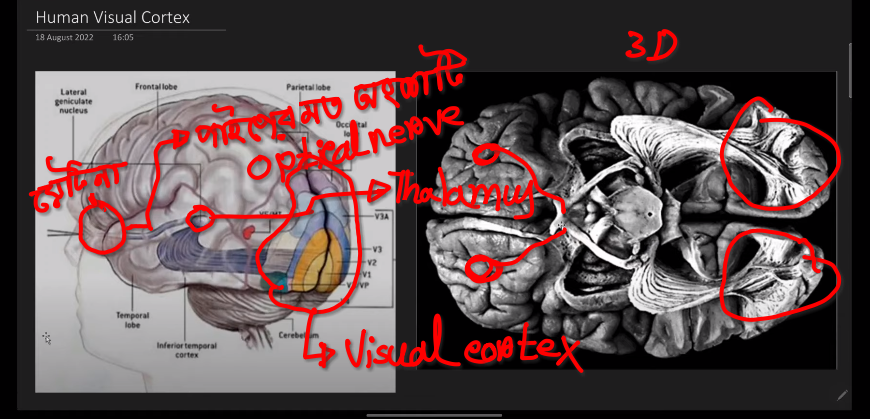
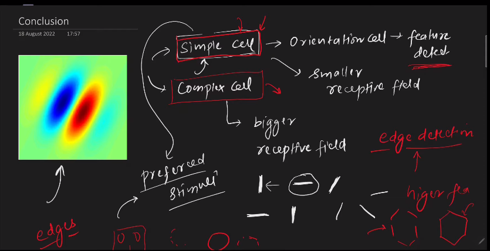

---

# CNN VS Visual Cortex 

---

# Concusion of The Famous Cat Experiment:

`আমাদের Visual Cortex এ দুই ধরনের cell আছে । i) Simple Cell ii) Complex Cell । Simple Cell Primitive Feature (Edges) Dectection করে । Complex cell, Simple cell যেই Feature গুলো capture করে যেই গুলোকে process করে next level এ নিয়ে যায় ।  `

