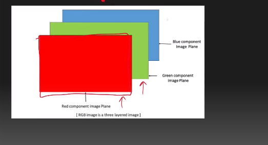

---

# Convolution Operation:

---

### Recap:

# Basic of Images:

`আমরা মূলত দুই ধরনের Image নিয়ে কাজ করি । i) Gray-scale image (black&white) ii) RGB_Colored Image । Image হচ্ছে pixel or grid নিয়ে তৈরি (28x28) resolution এর image mean (28x28) 2D matrix or grid । আর প্রত্যেকটা grid একটা ভ্যালু থাকে । In a grayscale image, the pixel values typically range from 0 to 255, where 0 represents black and 255 represents white । আর আমাদের কম্পিউটার একে 2D array বা numpy array হিসেবে store করে ।  Gray-scale image এ একটা মাত্র channel থাকে । `

`অন্যদিকে RGB image এ তিনটা channel থাকে (Red,Green,Blue) । In an RGB (Red, Green, Blue) image, each pixel contains three color channels: one for red intensity, one for green intensity, and one for blue intensity. Each of these channels typically ranges from 0 to 255, where 0 represents no intensity (black) and 255 represents full intensity (full color).`

