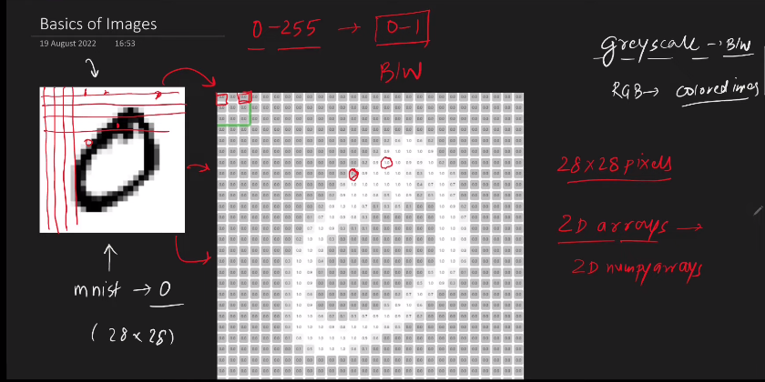
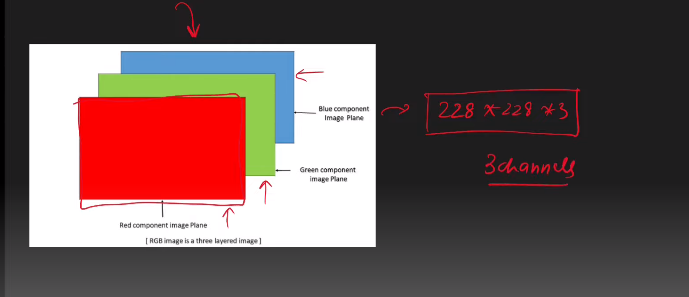
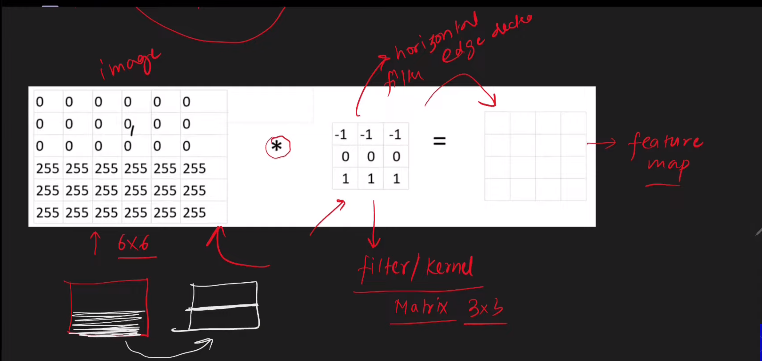

---

# Convolution Operation:

---

### Recap:

# Basic of Images:

`আমরা মূলত দুই ধরনের Image নিয়ে কাজ করি । i) Gray-scale image (black&white) ii) RGB_Colored Image । Image হচ্ছে pixel or grid নিয়ে তৈরি (28x28) resolution এর image mean (28x28) 2D matrix or grid । আর প্রত্যেকটা grid একটা ভ্যালু থাকে । In a grayscale image, the pixel values typically range from 0 to 255, where 0 represents black and 255 represents white । আর আমাদের কম্পিউটার একে 2D array বা numpy array হিসেবে store করে ।  Gray-scale image এ একটা মাত্র channel থাকে । `

`অন্যদিকে RGB image এ তিনটা channel থাকে (Red,Green,Blue) । In an RGB (Red, Green, Blue) image, each pixel contains three color channels: one for red intensity, one for green intensity, and one for blue intensity. Each of these channels typically ranges from 0 to 255, where 0 represents no intensity (black) and 255 represents full intensity (full color).`

# Edge Detection (Convolution Operation:)

`Edge হচ্ছে যেখানে, intensity অনেক পরির্তন হয় । যেমনঃ কোন মানুষের ছবির চুল আর মুখের transition point । উপরের ছবিতে আমরা ১ম ছবিরটীর Edge Detection করেছি । ২য় ছবিটি হলো ১ম ছবিটির vertial Edge Detection ৩য় ছবিটি হলো  ১ম ছবিটির horizontal Edge Detection । Mathematically, এই কাজ টা কীভাবে করে তা আমরা নিচে দেখবোঃ   `

`উপরের ছবিতে আমরা, Edge detection (pixel value intensity change, 0-> means black color 1-> white color) । 3x3  or any oddxodd dimention এর matrix  হলো  filter/kernal ছবিতে যেই kernal দেখানো হয়েছে সেটা দিয়ে horizontal edge dectect করা যায় । তারপর আমরা  image matrix এ kernal টি convolve (আমরা পরে দেখবো কীভাবে এই convolution operation কাজ করে) করার পর আমরা যেই result পায় তাকে বলে Feature Map ।  `

  

# -------------------------------------------------------------------

# Convolutions and Filtering:
 

## `Convolution Operation:`
In convolution, we basically apply a mathematical operator to each pixel and change its value in some way. To apply this mathematical operator, we use another matrix called a kernel. 

`Calculation:`

`কিন্তু আমরা যেহেতু, 3x3, 5x5 or oddxodd ব্যবহার করে  kernal এর middle point বরাবর output বসাচ্ছি, input এর শুরুতে যেইটা আছে সেইটা জন্য আমরা kearnal ব্যবহার করতে পারবো না । এর জন্য আমাদের padding with zero(i) এবং wrap around (ii). `

## `Frequency of a image: ` 

Frequency refers to the rate of change of pixel values. So we can say that the sharp edges would be **high frequency** content because the pixel values change rapidly in that region. Going by that logic, plain areas would be **low frequency** content.
  

`(যেমনঃ আমার  মাথার চুল আর মুখ যেইখানে মিলিত হয়েছে যেখানে(rate of change of pixel value বেশি) । কিন্তু যেইখানে শুধু চুল আর চুল সেইখানে (rate of change of pixel value কম ।)llow frequency reagion )।` 
  

**Low pass filter:** Low pass filter is the type of frequency domain filter that attenuates the high frequency components and preserves the low frequency components. 

**Low pass Filters:**
- It is used for smoothing the image.
- It attenuates the high frequency.
- It allows the frequency below cut off frequency to pass through it
- It consists of resistor that is follwed by capacitor.
- It helps in removal of aliasing effect.
 
 

**High pass filter:** High pass filter is the type of frequency domain filter that attenuates the low frequency components and preserves the high frequency components. 

**High pass Filters:**
- It is used for sharpening the image.
- It attenuates the low frequency.
- High frequency is preserved in it.
- It allows the frequencies above cut off frequency to pass through it.
- It consists of capacitor that is follwed by a resistor.
- It helps in removal of noise.
 

# Applying Custom Filters to Image:
### Ex- Blurring an Image:

 
**Function Used:**
output = cv2.filter2D(src,depth,kernel,anchor,border_type)  

**Color depth in lecture: 06 -> No. of bits used to indicate teh color of a single image. Total depth = 3*8 = 24 bits.**
**kernal: -> matrix we see in Convolution**  
**anchor:** In the cv2.filter2D() function in OpenCV, the anchor parameter represents the relative position of the anchor point within the kernel. The anchor point is the pixel in the kernel to which the convolution operation is applied to calculate the new value of the central pixel in the output image. 
**border_type:** we see the padding with zero and wrap around. And there are few more in openCV.
  

# -------------------------------------------------------------------

### `Observe the horizontal Edge Dector: `

### `Observe the vertical Edge Dector:  `

(filter for vertical edge dector)

`In deep learing, we fill the filter value randomly তারপর এই filter এর উপর backpoprogation কাজ করে কেমন output দিবে তা নিজেই decide করে । `

