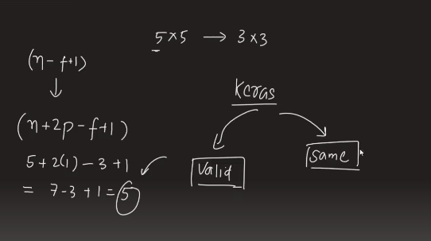
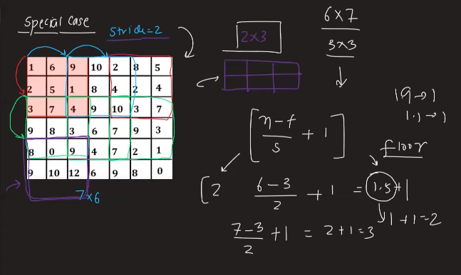

---

# Padding & Strides

---

`Problem with filter: আমরা filter ব্যবহার করার পর যে feature map পায় সেখানে আমাদের dimention এর কমে যায় । যেমনঃ 6x6 এর জন্য 3*3 হলে আমরা 4*4 এর feature map পায় । আর filter করার সময় ছবির উপরের যে pixel গুলো থাকে সেইগুলোকে fillter করার করার পর আমরা যেই feature map পায় সেখানে উপরের pixel গুলোর importance  কমে যায় । যদি side এ information বেশি থাকে তাহলে filter করার পর আমরা যেই feature map পাবো যেইখানে side এর information গুলো পাবো না । এই প্রবলেম দুইকে কে solve করে padding । `

# Padding :

`Actual image এর চারপাশে আমরা zero দিয়ে padding করে দেয় । একে padding with zero বলে । `

`zero দিয়ে padding করার পর (Actual image 5x5, After padding 7x7) হলে আমরা আউটপুট হিসেবে input image এর সমান dimention এর আউট পায় । `

`kears এ দুইধনের filter আছে । i)Valid দিলে Actual image পরিবর্তিত করে ।   আর ii)Same দিলে kears, Actual image অপরিবর্তিত রাখে । `

 

---

 

## Code Demo in Keras:

 

---

 

# __________ Strides __________:

`convolve করার পর আমরা এক step ডানের দিকে যায় একে বলে Strides উপরের ক্ষেত্রে Strides=1 । আবার একটা row complete করার পর আমরা যখন নিচের যাবো তখনও একধাপ নিচে নামচ্ছি । এক্ষেত্রেও Strides=1 । অর্থাৎ, আমাদের Strides এর Dimention  হলো 1x1 ।  আমরা Strides এর Dimention 2x2 ও করতে পারি । Strides এর Dimention 2x2 করার পর আমরা আগে যেখানে একটা step নিতেছিলাম এখন সেইখানে দুইটা করে নিব । এখন, Strides এর Dimention 2x2 করার ফলে আমাদের feature map এ কি কি impact পড়বে ।  `

`Strides এর Dimention করলে আমাদের feature map এ dimention কমে যায় যেইটা উপরের formula দিয়ে আমরা নির্ণয় করতে পারি । `

### Special Case:

`Strides ব্যবহার করা পর feature map এ dimention বের করার জন্য উপরের যেই formula তে decimal ভ্যালু আসতে পারে সেই ক্ষেত্রে আমরা floor নেই । কারণ, calculation করার সময় pixel value short পড়েছে । `

#### Stride  ব্যবহার করলে আমরা তাকে Stride Convolution বলি । 

# Why we use Stride ?

- `Stride value বেশি থাকলে শুধু High level feature dectect হবে । `
- `কোন বড় Dataset নিয়ে কাজ করলে Computing পাওয়ার কম করার জন্য Stride ব্যবহার করা হয় । `

 

---

 

## Code Demo in Keras:

 

---

 

