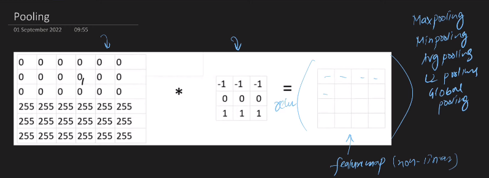

---

# Pooling in CNN:

---

`Convolution Operation করলে আমাদের দুই ধরনের সমস্যা হতে পারে । i) Memory Issue ii) Translation Variance । `

- `Memory Issue: `

`ধরি, আমাদের কাছে 228x228x3 একটা image আছে যেইখানে আমরা 100 টা filter use করবো । তাহলে আমাদের feature map এর dimention হবে 226*226*100 । আমরা যদি 32 bit flooting v ব্যবহার করি তাহলে (226*226*100*32) = 19MB এর মতো শুধু মাত্রে একটা ডাটা সেটের জন্য র‍্যামে  19MB data load করতে হবে । আর, আমাদের কাছে যদি 100 টা batch থাকলে র‍্যামে আমাদের 1.9 GB data load করতে হবে । যেইটা খুব inefficient । Strides use করলে আমরা Memory Issue সমস্যার সমাধান করতে পারি । কিন্তু, Strides, Translation Variance এর সমস্যাটির সমাধান করতে পারে না ।  `

- `Translation Variance: `

` Convolution Operation এর কাজ হচ্ছে feature খুঁজে বের করবে কিন্তু, সেইটা হবে location depended । Image classification এর ক্ষেত্রে আমরা দুইটা ছবি classify করতে যাবো, যেমন: ধরি বিড়ালের ক্ষেত্রে Convolution Operation যদি location depended হয় তাহলে বিড়ালের কান যদি দুইটা ছবিতে  দুই জায়গায় হয় তাহলে দুইটা ছবিকে আমাদের মডেল আলাদা আলাদা ভাবে Treat করবে । এই prb কে সমাধানের জন্য আমরা pooling use করি ।   `

# Pooling:

`Convolution Operation করার সময় relu activation function ব্যবহার করি ফলে আমাদের feature map এ non-liner ডাটা capture হয় । Non-linear feature map পাওয়ার পর আমরা pooling করি । Pooling হয়ে থাকে i) Max pooling ii) Min pooling iii) Average pooling iv) L2 pooling v) Global pooling .  `

`Picture এ যেই 4x4 দেখা সেইটা হচ্ছে  Non-linear feature map । pooling করার জন্য আমাদের তিনটা হচ্ছে i) size,generally (2x2) হয়ে থাকে । ii) stride, generally 2 । iii) type (max pooling) । Output হিসেবে 2x2 এর feature map পাবো । size (2x2) হওয়ার আর type = (max pooling) হওয়ার প্রথম ক্ষেত্রে, max(3,1,2,5) =5, max(1,3,0,2)=3, max(1,4,4,7) = 7, max(2,1,2,4) = 4, feature map[5,3,7,4] । `

