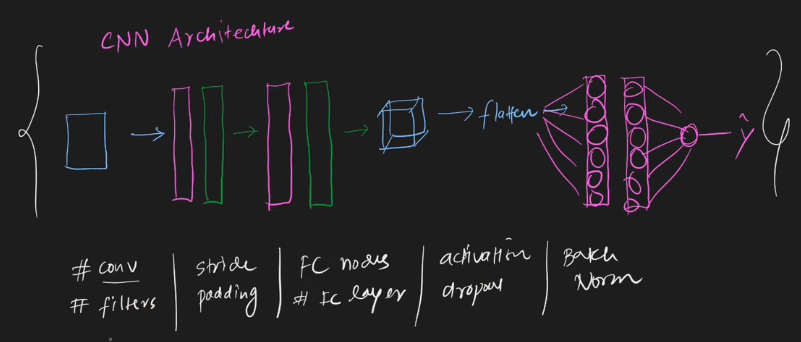

 

---
# CNN Architecture | LeNet -5 Architecture:
---

 

## `Recap: `

- `In conv1, we have filters.`

- `In pool1, we get pooling .`

- `We can repeat these process and then we use flatten to convert the data in 1D.`

`উপরের ছবিতে থাকা parameter গুলো change করে different type of cnn architecture পায় । `

# CNN Architecture:

---

## LeNet Architecture(1st CNN Architecture) by (yann Lecun  father of cnn):

---

`LeNet LeNet-5 5 layer . (32x32) image 6 filters of size (5x5), avg pooling layer of (2x2) of stride size of 2 repeat the process . Then do flatten and then fully connected layer with 120 neuron, then one fully connected layer with 84 neuron, as the final output (10 node) because they need to identify 10 digits. `

