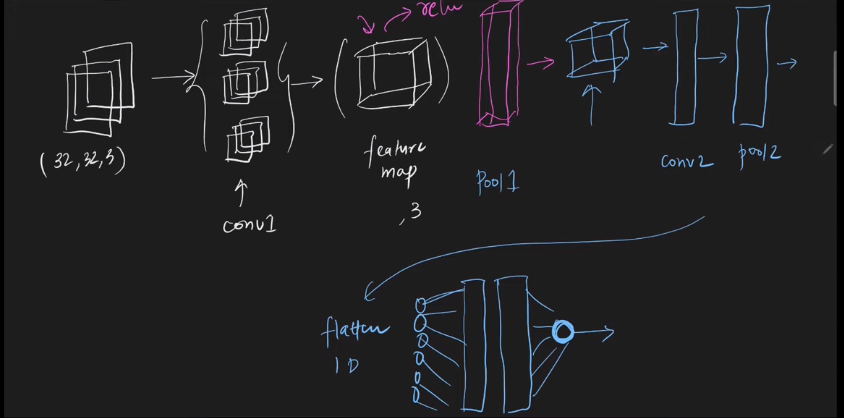

 

---
# CNN Architecture | LeNet -5 Architecture:
---

 

## `Recap: `

- `In conv1, we have filters.`

- `In pool1, we get pooling .`

- `We can repeat these process and then we use flatten to convert the data in 1D.`

