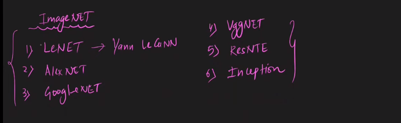
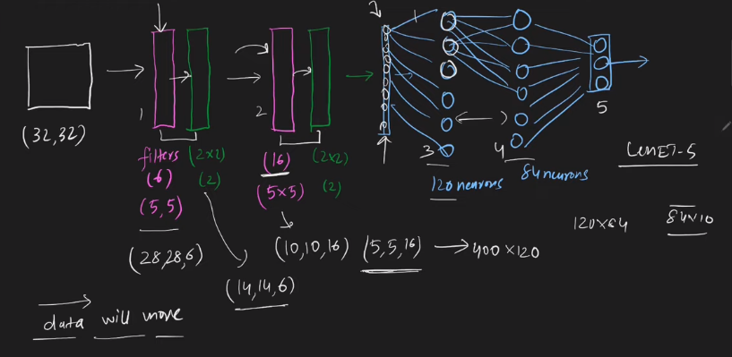

 

---
# CNN Architecture | LeNet -5 Architecture:
---

 

## `Recap: `

- `In conv1, we have filters.`

- `In pool1, we get pooling .`

- `We can repeat these process and then we use flatten to convert the data in 1D.`

`উপরের ছবিতে থাকা parameter গুলো change করে different type of cnn architecture পায় । `

# CNN Architecture:

---

## LeNet Architecture(1st CNN Architecture) by (yann Lecun  father of cnn):

---

`LeNet কে LeNet-5 ও বলে কারণ, এতে 5 layer থাকে । উপরের ছবির উহাঃ হিসেবে, (32x32) এর image ইনপুট হিসেবে ব্যবহার করা হয়েছে । তারপর এখানে,  6 filters of size (5x5) আছে, তারপর avg pooling layer of (2x2) of stride size of 2 ব্যবহার করে, process টা repeat করবো । Then আমরা flatten করবো, তারপর আমরা সেইটা fully connected layer with 120 neuron এর সাথে connect করবো তারপর আরেকটা fully connected layer with 84 neuron এর সাথে connect করবো । as the final output (10 node) because they need to identify 10 digits । `

---

# Code Implementation:

---

