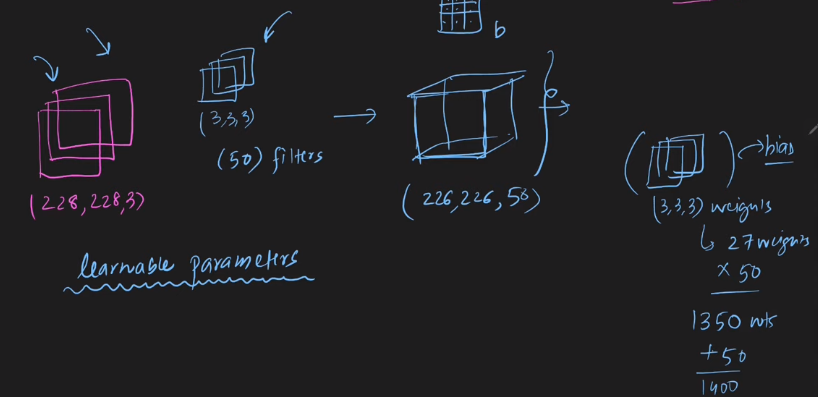

 

---

# Difference Between ANN and CNN:

---
 

`শুরুতে আমরা দেখেছিলাম কেন, ANN দিয়ে CNN এর প্রবলেম গুলো কেন solve করা যায় না । উপরের ছবি দেখে আরেকবার recap করে নিব ।  `

# Recap Working Process of CNN and ANN:

# Similarity:

`IN ANN Weights are trainable parameter, In a filter, filter value are also trainable parameter । ANN এ আমরা Weights গুলো সাথে input value গুন করে তার সাথে bias যোগ করে activation function এর মধ্যে দিই । CNN ও এমন হয়, আমরা filter value এর সাথে image এর pixel value  গুন করে তার সাথে bias যোগ করে activation function এর মধ্যে দিই ।  ` 

 

 

`উপরের ছবিতে,  Learnable parameter কয়টী ? (228x228x3) image size and (3x3x3) এর 50 টা filter । একটার জন্য 3x3x3 = 27 টা Weights আর 50 টা filter এর জন্য, 27x50 = 1350 Weights and 50 টা bias, In total Learnable parameter or trainable parameter হচ্ছে 1400 টা ।  `

`যদি আমাদের  image size (1080x1080x3) হয় তাহলে In total Learnable parameter or trainable parameter কতটি হবে ? 1400 টা । অর্থাৎ, image size এর যতই হোক না কেন সেইটা উপর  Learnable parameter or trainable parameter কতটি হবে সেইটা নির্ভর করতেছে না । `

