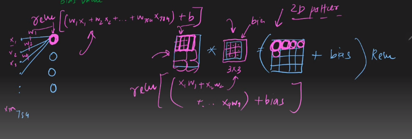

 

---

# Difference Between ANN and CNN:

---
 

`শুরুতে আমরা দেখেছিলাম কেন, ANN দিয়ে CNN এর প্রবলেম গুলো কেন solve করা যায় না । উপরের ছবি দেখে আরেকবার recap করে নিব ।  `

# Recap Working Process of CNN and ANN:

# Similarity:

`IN ANN Weights are trainable parameter, In a filter, filter value are also trainable parameter । ANN এ আমরা Weights গুলো সাথে input value গুন করে তার সাথে bias যোগ করে activation function এর মধ্যে দিই । CNN ও এমন হয়, আমরা filter value এর সাথে image এর pixel value  গুন করে তার সাথে bias যোগ করে activation function এর মধ্যে দিই ।  ` 

