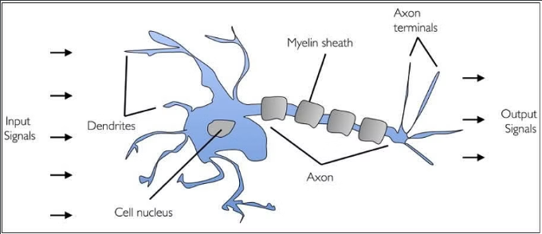
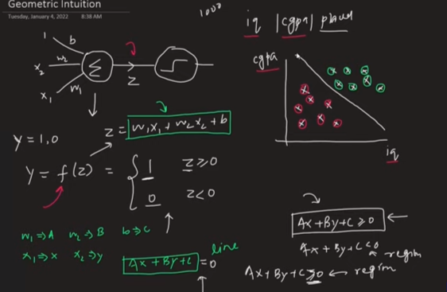

# Table of content:

- Biological Neutrons?
- What is a perceptron?
- Perceptron in Machine Learning.
- Why is Perceptron called a Binary Classifier ?

# Biological Neuron:

A human brain has billions of neurons. Neurons are interconnected nerve cells(neurons) in the human brain that are involved in processing and transmitting chemical and electrical signals. Dendrites are branches that receive information from other neurons.

						Fig: Biological Neuron

					Fig: Connection of Two Neurons 

 

Cell nucleus or Soma processes the information received from dendrites. Axon is a cable that is used by neurons to send information. Synapse is the connection between an axon and other neuron dendrites.

# Rise of Artificial Neurons (Based on Biological Neuron):

Researchers Warren McCullock and Walter Pitts published their first concept of simplified brain cells in 1943. This was called the McCullock-Pitts (MCP) neuron. They described such a nerve cell as a simple logic gate with binary outputs.

### What is Artificial Neuron?
An artificial neuron is a mathematical function based on a model of biological neurons, where each neuron takes inputs, weighs them separately, sums them up and passes this sum through a nonlinear function to produce output.

### Biological Neuron vs. Artificial Neuron:

# Perceptron:

Perceptron was introduced by Frank Rosenblatt in 1957. He proposed a Perceptron learning rule based on the original MCP neuron. A Perceptron is an algorithm for supervised learning of binary classifiers. This algorithm enables neurons to learn and process elements in the training set one at a time.

					Fig: Perceptron

### Types of Perceptron:

- **Single layer:** Single layer perceptron can learn only linearly separable patterns.

- **Multilayer:** Multilayer perceptrons can learn about two or more layers having a greater processing power.

				Fig: (a) Single Layer Perceptron
				Fig: (b) Multi layer Perceptron

# Basic Components of Perceptron:

Perceptron is a type of artificial neural network, which is a fundamental concept in deep learning. The basic components of a perceptron are:

**Input Layer:** The input layer consists of one or more input neurons, which receive input signals from the external world or from other layers of the neural network.

**Weights:** Each input neuron is associated with a weight, which represents the strength of the connection between the input neuron and the output neuron.

**Bias:** A bias term is added to the input layer to provide the perceptron with additional flexibility in modeling complex patterns in the input data.

**Activation Function:** The activation function determines the output of the perceptron based on the weighted sum of the inputs and the bias term. Common activation functions used in perceptrons include the step function, sigmoid function, and ReLU function.

**Output:** The output of the perceptron is a single binary value, either 0 or 1, which indicates the class or category to which the input data belongs.

**Training Algorithm:** The perceptron is typically trained using a supervised learning algorithm such as the perceptron learning algorithm for backpropagation. During training, the weights and biases of the perceptron are adjusted to minimize the error between the predicted output and the true output for a given set of training examples.

Overall, the perceptron is a simple yet powerful algorithm that can be used to perform binary classification tasks and has paved the way for more complex neural networks used in deep learning today.

**Note:** `Supervised Learning is a type of Machine Learning used to learn models from labeled training data. It enables output prediction for future or unseen data.`

# Activation Function: 

#### Step Function: 
In Mathematics, a step function (also called a staircase function) is defined as a piecewise constant function that has only a finite number of pieces. In other words, a function on the real numbers can be described as a finite linear combination of indicator functions of given intervals.

Example: 
Draw a graph of the step function:

Solution:

From the given,

-2, 0, 2 are the values of y.

x < -1 means the values of x = …, -4, -3, -2, -1

-1 ≤ x ≤ 2 means, x = -1, 0, 1, 2

x > 1 means the values of x = 1, 2, 3, 4, …..

By plotting these values on a graph paper, the below graph will be obtained.

The above graph is viewed as a group of steps and hence it is also called a step function graph. The left endpoint in every step is blocked(dark dot) to show that the point is a member of the graph, and the other right end arrow indicates that the values are infinite. That means only definite values are shown with dark dots.

# What is a Binary classifier in Machine Learning?

In ML(Machine Learning)  ML algorithms can be broadly categorized into three types: supervised learning, unsupervised learning, and reinforcement learning.
- Supervised 
- Unsupervised 
- Reinforcement

In, Supervised learning there are two categories of algorithms:
 i) Classification
 ii) Regression

Binary classification is a fundamental task in machine learning, where the goal is to categorize data into one of two classes or categories.

		Fig: Binary Classification

		Fig: Multi Classification

Simillary, perceptrons classify its data like Calcification. For example,
 ধরি, কয়েকটা student এর iq, cgpa and placement result দেওয়া আছে । placement হলে ১ আর না হলে 
০ । অর্থাৎ, আমাদের এইখানে দুইটা input value x1 and x2 দেওয়া আছে । আমরা algorithm এর মাধ্যমে, 
W1,W2  এবং b এর মান বের করবো । অর্থাৎ, 
To determine the perceptron value the mathematical formula is, 
∑wi*xi = x1*w1 + x2*w2 +…wn*xn
Y = f(∑wi*xi + b).

 
 

 
Now, replace W1 = A, W2 = B , b = c and X1 =x , Y1 = y we get a linear equation. Then, we make a
figure, 	in the x-axis we give IQ and in the y-axis we give CGPA then we draw a line by linear Programming . 
আমরা যেহেতু W1,W2  এবং b এর মান জানি নতুন কোন  input জন্য এর রেখার ঐ পাশে হলে বা positive হলে সেই নতুন student টি placement হওয়ার সম্ভবনা আছে । আর negative হলে এর তার কোন placemnet হওয়ার সম্ভবনা নেই । 
As the perceptron model is like binary classification that’s why we call the perceptron a binary classifier.
