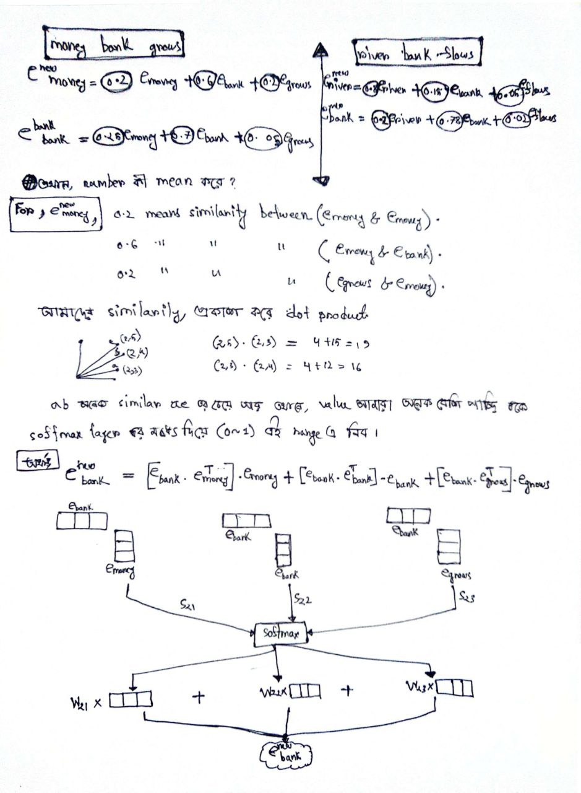
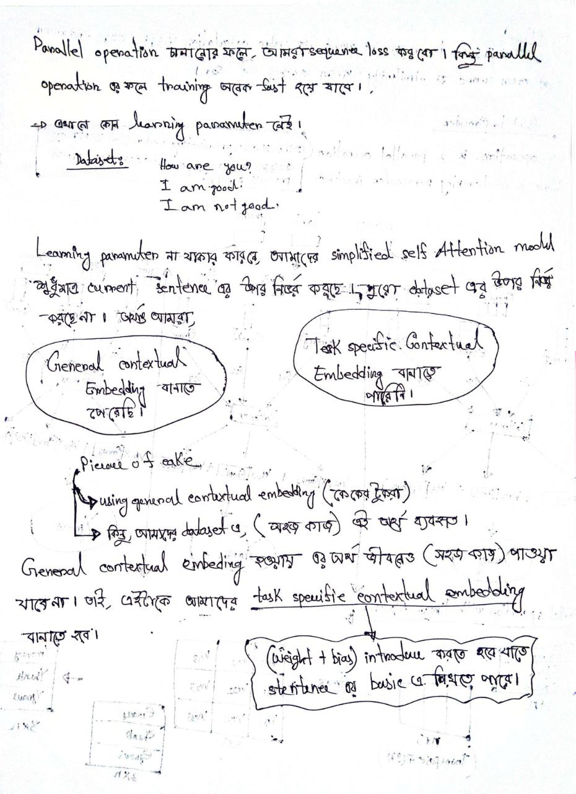
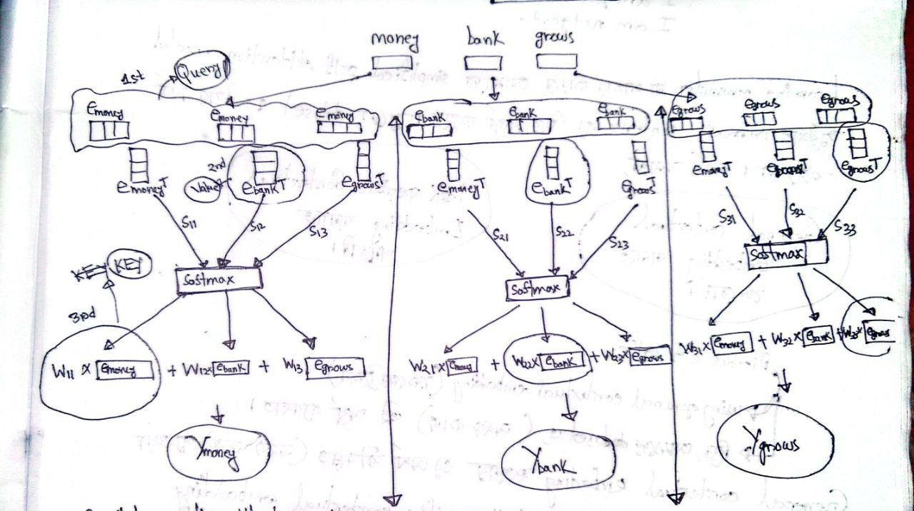

 

---
---

# Self Attention:

`NLP task গুলোর জন্য সবচেয়ে গুরুতপূর্ণ কাজ হলো text vectorization. Text Vectorization এর জন্য আমরা i) OHE ii) Bag of Words iii) Tf-Idf দেখেছি । সবচেয়ে modified text vectorization technique হচ্ছে word2vec but word2veg এর কিছু আছে । i) Apple is healthy. ii) Apple is better than orange. iii) An apple a day keep doctor way. iv) Apple make iphone. এই ৪ টা sentence  (dataset) দিয়ে   word2vec train করলে [apple_food apple_techlonogy] = [0.8 0.2] এই feature গুলো তৈরি হলো। এখানে, apple_techlonogy হিসেবে ব্যবহৃত হয়েছে এর value 0.2 মাত্র। এখন আমাদের কাছে যদি কোন sentence আসে সেখানে apple_techlonogy হিসেব ব্যবহৃত হয়েছে কিন্ত word2vec, static হওয়ায় আমাদের কাছে apple_food এইটার আসবে কারণ, word2vec আমাদের average meaning capture করে ।  `

- `self attention হচ্ছে, আরেকটা word embedding technique যেইটা current context অনুযায়ী  করতে পারে । `

 

 

 

 

`আমাদের general ontextual embedding এ যার text vectorization করবো সেইটা ৩টা আলাদা আলাদা role পালন করেতেছে {ছবিতে প্রথম diagram এ e_money, query, key,value} । e_money_query (e_money,e_bank,e_grows) কে করছে তাদের মধ্যে কত । (e_money,e_bank,e_grows) উত্তর দিচ্ছে । আর কি উত্তর দিচ্ছে সেইটা আছে e_key গুলোতে ।  `

---
---
