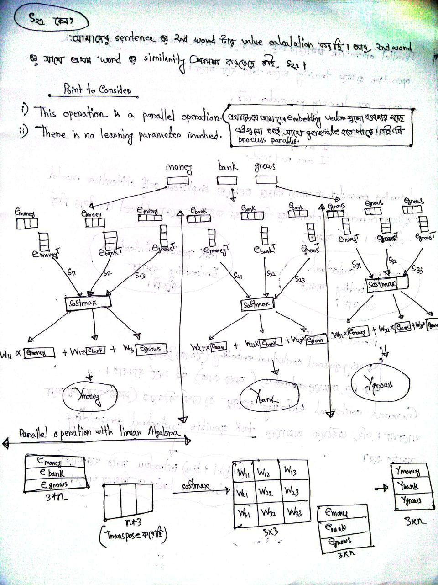
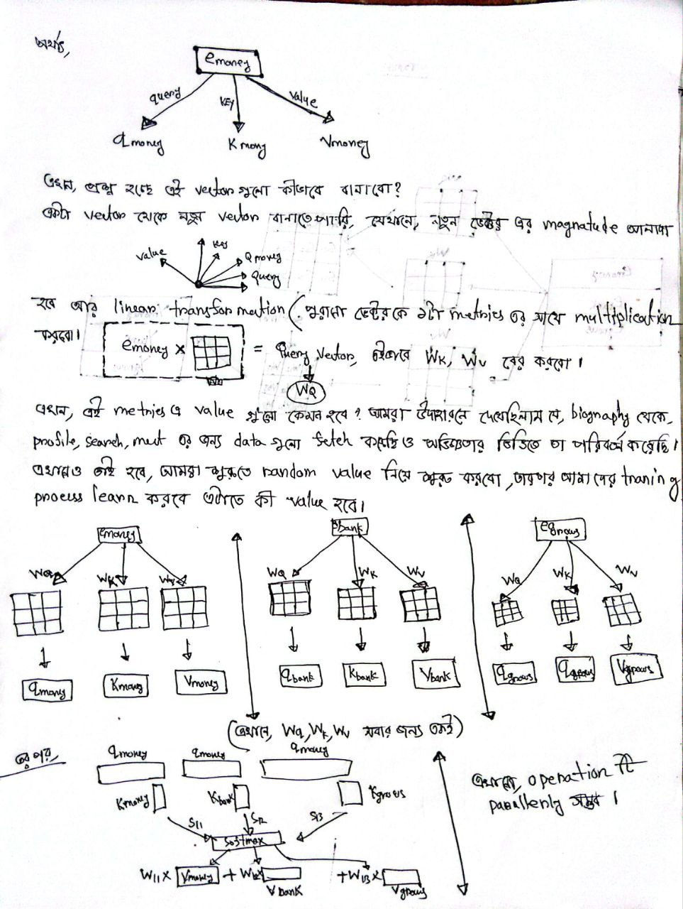
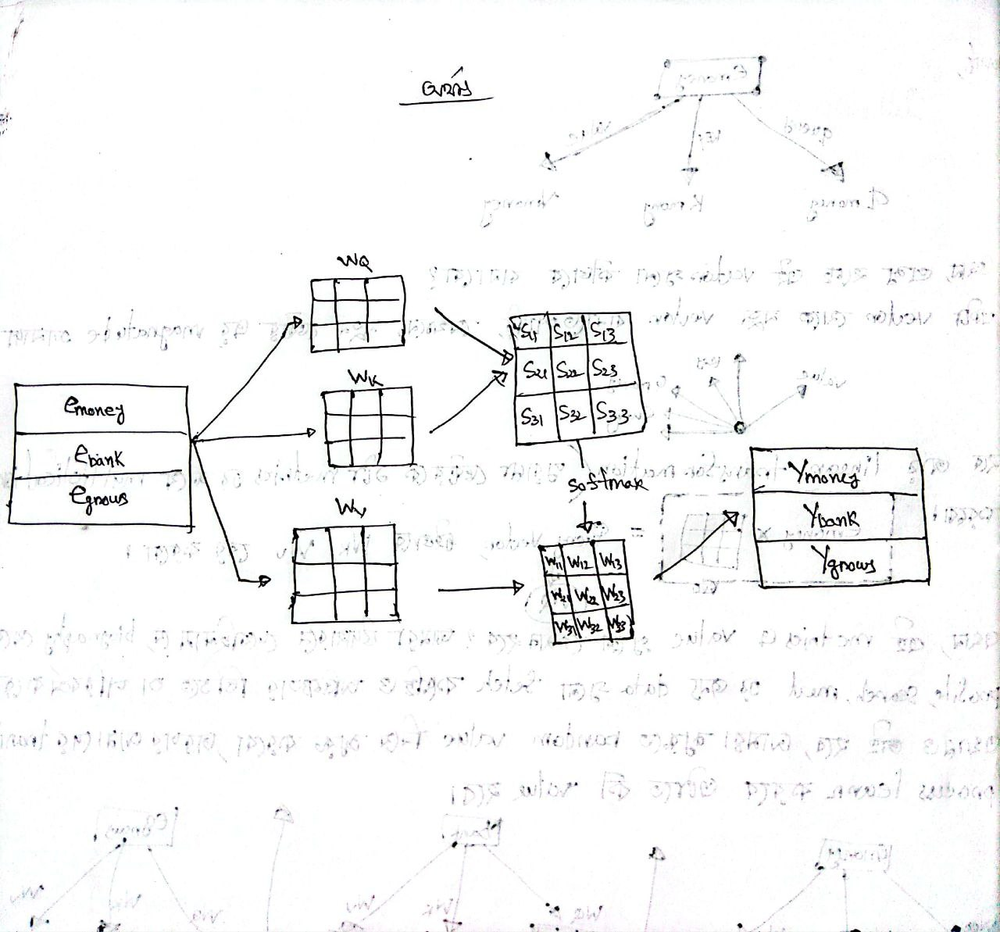

 

---
---

# Self Attention:

`NLP task গুলোর জন্য সবচেয়ে গুরুতপূর্ণ কাজ হলো text vectorization. Text Vectorization এর জন্য আমরা i) OHE ii) Bag of Words iii) Tf-Idf দেখেছি । সবচেয়ে modified text vectorization technique হচ্ছে word2vec . but Text Word Embedding এর কিছু limitions আছে । i) Apple is healthy. ii) Apple is better than orange. iii) An apple a day keep doctor way. iv) Apple make iphone. এই ৪ টা sentence  (dataset) দিয়ে   train করলে [apple_food apple_techlonogy] = [0.8 0.2] এই feature গুলো তৈরি হলো। এখানে, apple_techlonogy হিসেবে ব্যবহৃত হয়েছে এর value 0.2 মাত্র। এখন আমাদের কাছে যদি কোন sentence আসে সেখানে apple_techlonogy হিসেব ব্যবহৃত হয়েছে কিন্ত Word Embedding, static হওয়ায় আমাদের কাছে apple_food এইটার আসবে কারণ,Word Embedding আমাদের average meaning capture করে ।  `

- `self attention হচ্ছে, আরেকটা word embedding technique যেইটা current context অনুযায়ী  output generate করতে পারে । `

 
 

 
 

 
 

 
 

`আমাদের general ontextual embedding এ যার text vectorization করবো সেইটা ৩টা আলাদা আলাদা role পালন করেতেছে {ছবিতে প্রথম diagram এ e_money, query, key,value} । e_money_query (e_money,e_bank,e_grows) কে করছে তাদের মধ্যে কত । (e_money,e_bank,e_grows) উত্তর দিচ্ছে । আর কি উত্তর দিচ্ছে সেইটা আছে e_key গুলোতে ।  `

 

`কিন্তু সমস্যা হচ্ছে, query, key,value একটা ভেক্টর ঐ হচ্ছে । এইটা আমদের কাছে efficient way না । যদি তিনটা কাজ একটা ভেক্টর দিয়ে করি তাহলে হয়তো আমাদের efficient ভালো হবে না । তাই আমরা তিনটা ভেক্টর বানাবো । যেমনঃ আমদের কেউ বিয়ে করতে গেল । তার নিজের একটা biography লিখা আছে । এখন, কোন মেয়েকে তো বলবে না যে আমি কেমন সেইটা আমার দেখে পড়ে নাও । ১) সেই ব্যক্তিটি একটা ম্যারেজ ওয়েবসাইটে গিয়ে নিজের প্রফাইল বানাবে, সেক্ষেত্রে তো উনি ওয়েব সাইটকে বলতে পারে না আমার biography দেখে আমার প্রোফাইল সাজাও । ২) ব্যক্তিটি তার নিজের পচ্ছের মেয়েকে সার্চ করবে সেক্ষেত্রে উনি ওয়েব সাইটকে বলতে পারে না যে আমার কেমন ধরনের মেয়ে পচ্ছন্দ তা থেকে দেখে biography নাও । ৩) ধরি, কোন মেয়েকে তার পচ্ছন্দ হলো, তো সে ম্যেয়ের তার সর্ম্পকে জানতে চাইবে, তো উনি সেই মেয়েকে বলতে পারে না আমার biography দেখে জানুন । এখানে, তিনটি কাজের জন্য আমরা ডাটা কিন্তু সেই biography থেকেই নিব । এখন, কথা হচ্ছে সেই ব্যক্তি যেন মেয়েটিকে বিয়ে করতে পারে সেই জন্য এই তিনটি কাজের জন্য ডাটা গুলোকে ভালো করে organized করতে হবে । সেই ব্যক্তি  হয়তো কোন মেয়ে তাকে reject করবে সেই থেকে উনি তার এই তিনটি কাজের জন্য ভ্যালুকে modify করবে, মোট কথায় exprience থেকে learning হবে । ঠিক একই ভাবে আমাদের query, key,value ভেক্টর গুলো লাগিয়ে  learning করাবো । `

 
 

 
 

---
---
