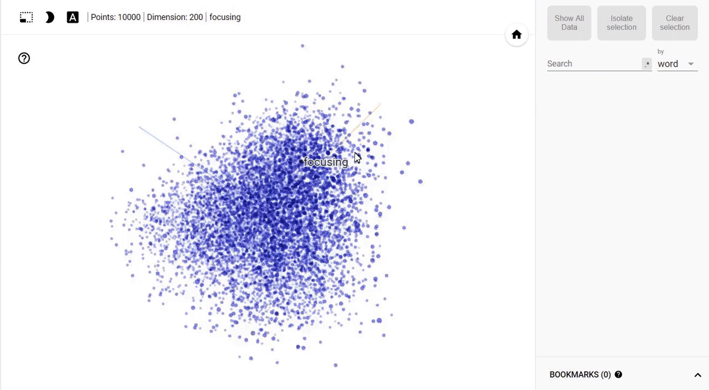
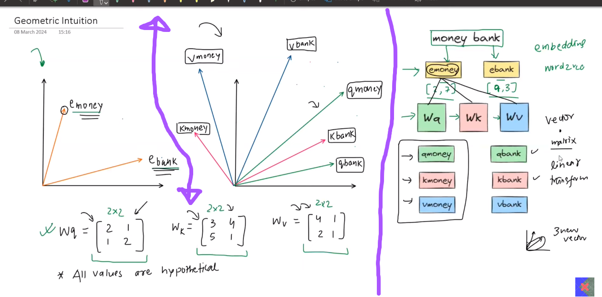
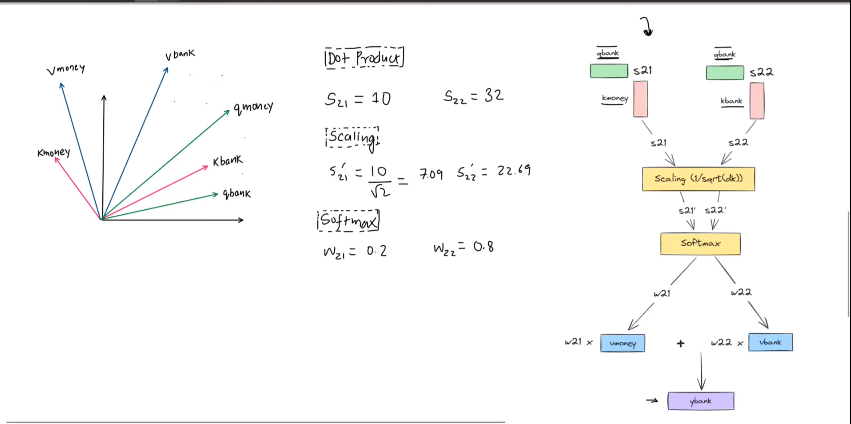

 
 

# `# Word2Vec Visulization: `

 
 

### [**tensorflow_visulization_link**](https://projector.tensorflow.org/)

[**TensorFlow Projector**](https://projector.tensorflow.org/) ওয়েবসাইটটি ব্যবহার করে আমরা Word2Vec-এর মতো প্রি-ট্রেইনড embedding মডেলের ভেক্টরগুলো visulize করতে পারি। Word2Vec মডেলে প্রতিটি শব্দের জন্য সাধারণত ৫১২ ডাইমেনশনের embedding ভেক্টর পাওয়া যায়। 

এই ভেক্টরগুলোর dimentionality reduction technique যেমনঃ  PCA (Principal Component Analysis) বা অন্যান্য টেকনিক ব্যবহার করে, ভেক্টরগুলোকে ৩ ডাইমেনশনে আনা হয়। উদাহরণস্বরূপ, PCA ব্যবহার করে এই ৫১২ ডাইমেনশনের কমিয়ে আনা ভেক্টরগুলোকে ৩ ডাইমেনশনে আনা হয়, যা এরপর থ্রিডি স্পেসে visulize করা যায়। এই প্রক্রিয়াটি আপনাকে শব্দগুলোর মধ্যকার সম্পর্ক ও ক্লাস্টারিং সহজে বুঝতে সাহায্য করে। 

 
 
 

 

`আমরা শুরুতে, random value নিয়ে, Wq, Wk, Wv matrix বানিয়েছি । তারপর আমরা সেইটাকে linear transformation করে Query,Key and Value vector বানিয়েছি । উপরের আমাদের প্রথম ছবিটার বাম পাশের গ্রাফে Word2vec বা other কোন embedding ব্যবহার করে, আমরা যেই embedding vector পেয়েছি, সেই embedding vector এর গ্রাফ । ডান পাশে, দুইটার জন্য যে ছয়টা vector পাবো তার গ্রাফ ।  `

[**visulization**](https://www.geogebra.org/m/YCZa8TAH) visulization linear transformation.

 
 

Now, finding the embedding vector (not General Contextual Embedding) we will make (Task Specific Contextual Embedding).

 
 

 
 

