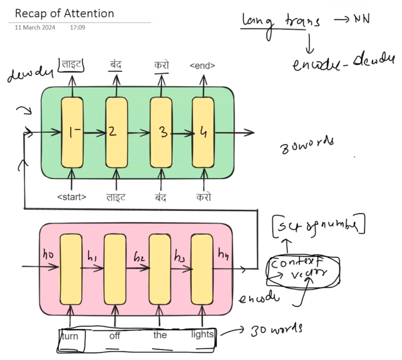
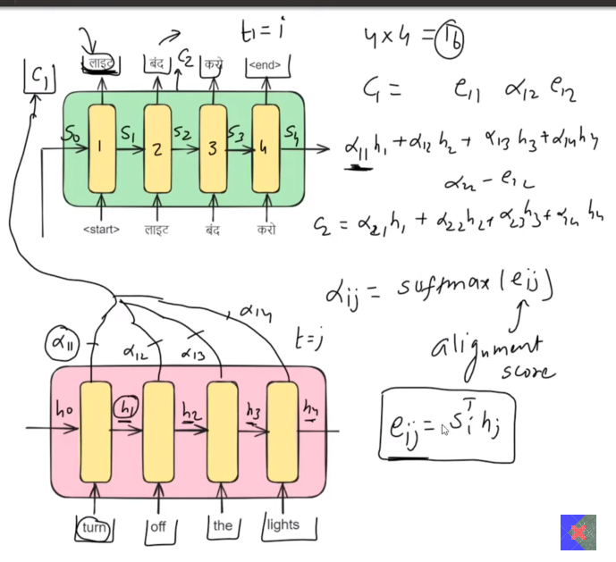

---
---
---

 
 

# `#1 Why self-attention is called self?: `

 
 

---
---
---

 
 

 

আমরা ভাষা অনুবাদ করার কাজটি সমাধান করতে চেষ্টা করছিলাম নিউরাল নেটওয়ার্ক এবং ডিপ লার্নিং ব্যবহার করে। একটা ইংরেজিতে বাক্য ছিল এবং আমরা তার হিন্দি অনুবাদ করার চেষ্টা করতেছিলাম। এই ধরনের কাজ বা  sequence to sequence problem সমাধান করার জন্য আমরা encoder-decoder architecture ব্যবহার করেছিলাম। Encoder-decoder architecture এ একটি encoder এবং একটি decoder রয়েছে, `Encoder and Decoder(উভয়ের মধ্যেই LSTM রয়েছে)` । এখন আমরা যখন কোন বাক্য এই architecture দেয় তখন, Encoder এই sentence কে প্রসেস করে, একটা hidden state maintain করে timestep(h1,h2,h3,h4) । এই ভ্যালু গুলোকে একটা vector এর মধ্যে রাখলে এই vector কে context vector বলে । আমরা এই বাক্যের মধ্যে থাকা সমস্ত তথ্যকে সংক্ষেপণ করে এই context vector এ রাখি । তারপর আমরা এই সংক্ষেপণটি(context) vector কে decoder পাঠিয়ে দিই। এখন ডিকোডার যা করে তা হল এটি এই কনটেক্সট ভেক্টরটি নিয়ে আমাদের আউটপুটটি ধাপে ধাপে translation করে দেয় ।

 

এখন এই পদ্ধতি ভালো ছিল কিন্তু এই পদ্ধতির একটি বড় সমস্যা হলো,  পুরো বাক্যটির summary  বোঝার দায়িত্ব এই context vector এর উপর দিয়েছি । এই context vector, set of number ছাড়া আর কিছুয় না । যদি কোনওভাবে আমাদের ইনপুট paragraph, ৩০ শব্ধের বেশি হয়ে যায়, তাহলে এই context vector সবকিছুর summary ধারণ করতে পারবে না। ঠিক আছে, তারপর গবেষকরা লক্ষ্য করলেন যে যদি আপনি ৩০টির বেশি শব্দ ব্যবহার করা হয়, তাহলে বাক্যগুলির অনুবাদটির গুণমান খারাপ হয়ে যায় ।  সমস্যা সমাধানের Attention Mechanism এসেছে ।  

 

# `# Attention Mechanism: `

Attention mechanism সম্পূর্ণ বাক্যটি দেখার পরে, পুরো বাক্যটির summary  বোঝার দায়িত্ব একটা context vector এর উপর না দিয়ে, output এ আলাদা আলাদা time step এর জন্য
আলাদা আলাদা context vector send করে । অর্থাৎ, তখন প্রথম শব্দটির meaning বের করার জন্য input শব্দগুলির মধ্যে কোনটার meaning প্রথম শব্দটির meaning এর সাথে match করে । 

এখন আমরা যদি, c1 এর context vector বের করতে চায় তাহলে, এর সূত্র হলো, 
c1 =  (apha11*h1) + (apha12*h2) +   (apha13*h3) +   (apha14*h4)
simillarly,
c2 =  (apha21*h1) + (apha22*h2) +   (apha23*h3) +   (apha24*h4)

এখন, এই আলাফা গুলোর মান কীভাবে বের করা হবে? আলাফা(i,j) is proportion to sofmax(e_ij), যেখানে, e_ij হচ্ছে, alignment score । 

In Luong Attention we calculate the alignment score like,

`(আমরা decoder এর hidden state(S1,S2,S3,S4) এর সাথে encoder এর hidden state(H0,H1,H2,H3) গুন করতাম)`

IF,
timestep in output is, i 
timestep in input is , j

e_ij = Transpose of(S_i) . (h_j)

 

# `# Now, compare the luong attention and bahdanau attention with self attention: `

 

