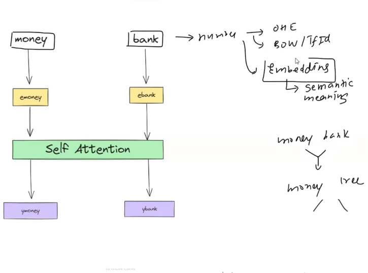
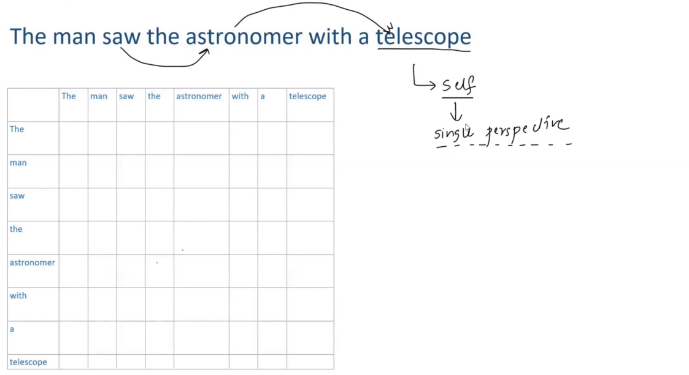
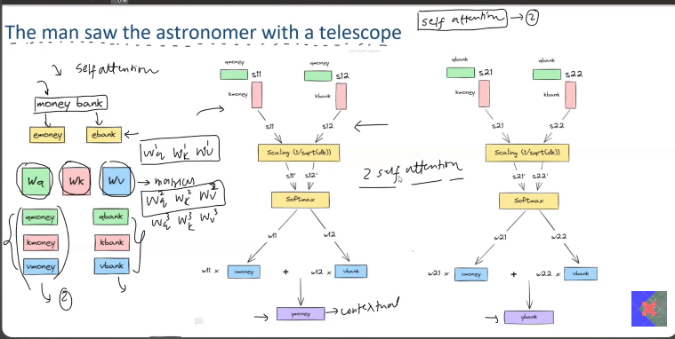
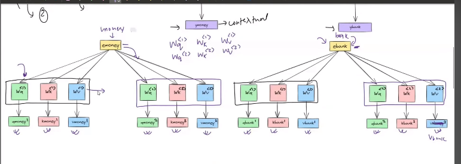
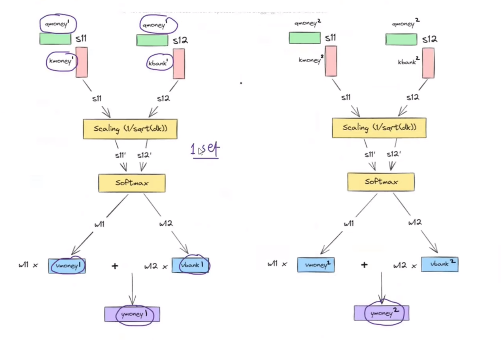
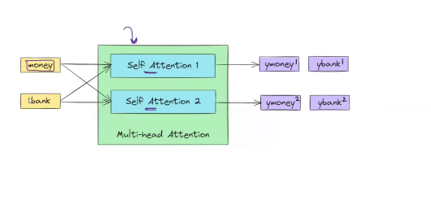
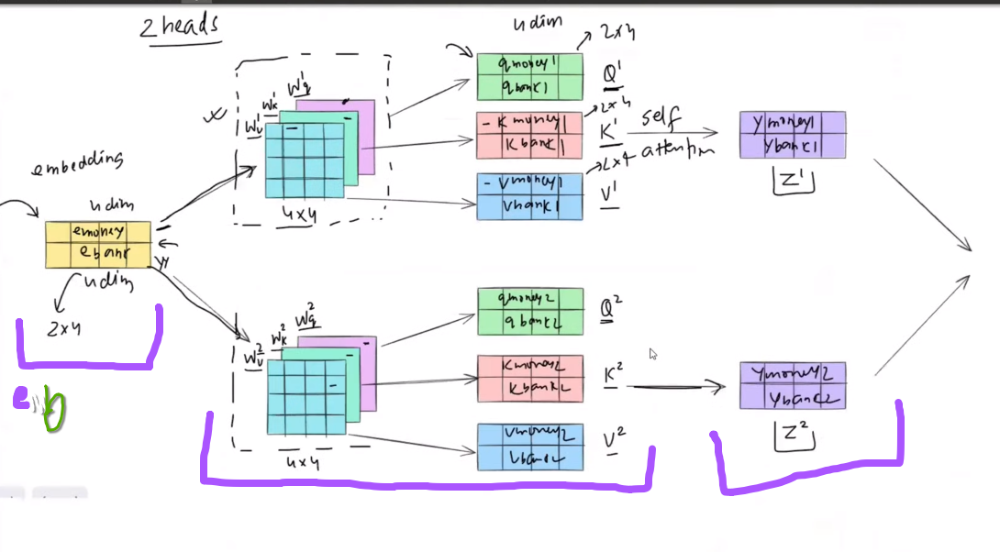
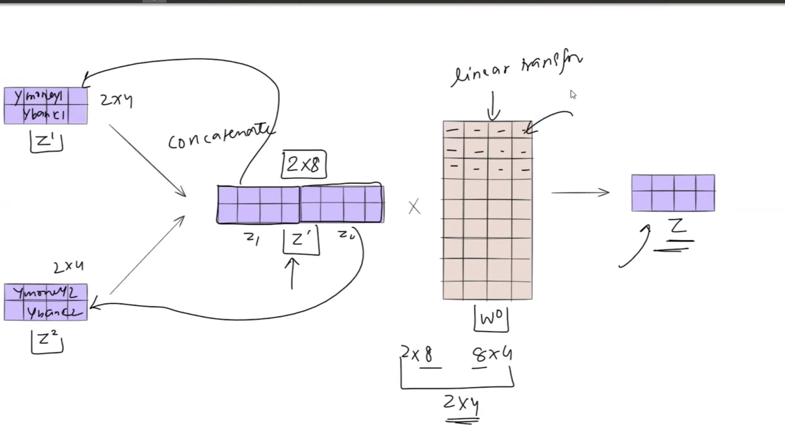
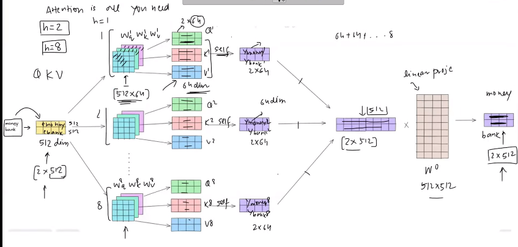

 
 

# `# Multi-head Attention: `

 
 

# `#77.1 Before Starting Multi-head Attention: Recap-> Self Attention: `

 

 

Self Attentin কী? সহজ কথায়, Self Attentin এমন একটি কৌশল যার মাধ্যমে আমরা  contextual embeddings তৈরি করতে পারি । একটি বাক্য আছে 'Money Bank' এবং এটি সংখ্যার মাধ্যমে উপস্থাপন করতে হবে। তো এখন আমাদের কাছে,
- OHE
- BoW
- TF-IDF
- Embedding(Word2Vec)

কারণ, Embedding এর সবচেয়ে বড় বৈশিষ্ট্য হলো এটি শব্দের অর্থ (semantic meaning) ধরতে পারে। উদাহরণস্বরূপ, 'Money' এবং 'Bank' এর Embedding এর মান কাছাকাছি থাকবে। অন্যদিকে, 'Money' এবং 'Tree' এর Embedding মান অনেক দূরে থাকবে। কিন্তু এম্বেডিংসের একটি বড় সমস্যা হলো এটি স্ট্যাটিক। অর্থাৎ, একটি শব্দের একটি নির্দিষ্ট মান থাকবে এবং সেটি সর্বত্র ব্যবহৃত হবে। যেমন, 'Bank' শব্দটি এখানে আরেকটি বাক্যে নদীর কিনারা হিসেবে ব্যবহৃত হলেও এর Embedding মান একই থাকবে, যদিও দু'টি বাক্যে এর অর্থ ভিন্ন। এই সমস্যাটির সমাধান করার জন্য Self Attention এসেছে।

 

 

**Self Attention** contextual embeddings তৈরি করতে পারে। এর মানে হলো embeddings নির্ভর করবে প্রেক্ষাপটের উপর। যেমন, যদি 'Bank' শব্দটি 'Money' এর সঙ্গে থাকে, তখন এর মান একরকম হবে। আর যদি 'Bank' শব্দটি 'River' এর সঙ্গে থাকে, তখন এর মান ভিন্ন হবে।
self attention এর  মাধ্যমে  embedding,  dynamic হয়ে যায়। এখন কথা হচ্ছে, এই প্রক্রিয়াটি কিভাবে কাজ করে? এটি শুরু হয় তিনটি পদক্ষেপ থেকে:
- ১. প্রথমে একটা ইনপুট বাক্য নেই । 
- ২. সেটিকে Embeddings এ convert করি । 
- ৩. প্রতিটি Embeddings থেকে একটি কুইরি (Query), কি (Key) এবং ভ্যালু (Value) বের করি ।
এরপর, আপনি Query and  Key এর ডট প্রোডাক্ট বের করি । এর ফলে আমরা একটি similarity score  পায়। এভাবে প্রতিটি শব্দের জন্য similarity score পাবো ।  এরপর স্কোরটি (Softmax) ফাংশনের দিলে যে মান পাবো তার সাথে আমরা, Value vector গুণ করে, সবগুলোর মান যোগ করি । একদম শেষে আমরা যে ভ্যালু ভেক্টরটি পাই একে contextual embedding বলি । 

 

# `#77.2 Problem with Self Attention: `

 

 

**The man saw the astronaut with a telescope**। এখন যদি আমি বলি এর অর্থ কী হতে পারে, তাহলে একটি অর্থ হতে পারে যে, `একজন ব্যক্তি টেলিস্কোপের মাধ্যমে একজন নভোচারীকে দেখতেছে`। আবার, এটি আরেকটি অর্থ হতে পারে যে, `একজন ব্যক্তি একজন নভোচারীকে একটি টেলিস্কোপের সাথে দেখেছে`। এই বাক্যটির অর্থ নিয়ে কিছু বিভ্রান্তি রয়েছে। ফলে দুটি সম্ভাব্য অর্থ বেরিয়ে আসছে। কিন্তু দুর্ভাগ্যবশত, self attention এই দুটি অর্থের মধ্যে কেবল একটিকেই বুঝতে পারে । অর্থাৎ, self attention সবচেয়ে বড় সমস্যা হলো এটি একটি বাক্য বা ডকুমেন্টের শুধুমাত্র একটি দৃষ্টিভঙ্গি ধরতে পারে। যদি একাধিক meaning থাকে, তাহলে সেল্ফ-অ্যাটেনশন সেগুলো ধরতে অক্ষম। দুর্ভাগ্যবশত, ন্যাচারাল ল্যাঙ্গুয়েজ প্রসেসিং-এর অনেক ক্ষেত্রে একাধিক meaning ধরার প্রয়োজন হয়।  
উদাহরণস্বরূপ, ধরি আমরা একটা document summrization tool তৈরি করেছি, যার কাজ একটি ডকুমেন্ট দেখে তার সারাংশ তৈরি করা। এখন যদিআমরা কেবল self attention ব্যবহার করি, তাহলে আমরা কেবল একটি দৃষ্টিভঙ্গি থেকেই সারাংশ তৈরি করতে পারবো । কিন্তু, আমাদেরকে এমন একটি মেকানিজম তৈরি করতে হবে যাতে একই ডকুমেন্ট থেকে একাধিকবার বিভিন্ন দৃষ্টিভঙ্গি থেকে সারাংশ তৈরি করতে পারে। কিন্তু, সেল্ফ-অ্যাটেনশন নিজেই একটি শক্তিশালী technique হলেও এটি একটি ডকুমেন্টে শুধুমাত্র একটি দৃষ্টিভঙ্গি থেকে দেখে এবং কেবল একটি টেবিল আকারে তথ্য তৈরি করে (উপরে যে table রয়েছে) । এই টেবিলটি কী? এটি প্রতিটি শব্দের সাথে অন্য শব্দের সাদৃশ্যের একটি টেবিল। অনেক সময় এতে লুকানো অর্থ বা একাধিক দৃষ্টিভঙ্গি থাকে যা এটি ধরতে পারে না। এই সমস্যার সমাধান করতে  Multi-head Attention এসেছে । 

Multi-head Attention একটি সহজ সমাধান প্রস্তাব করে। এটি বলে, যদি আপনার কাছে এমন একটি বাক্য থাকে, যেমন এই বাক্য **The man saw the astronaut die with the telescope**, যেখানে দুটি অর্থ রয়েছে, তখন আপনি সেল্ফ-অ্যাটেনশনের সাহায্যে একাধিক দৃষ্টিভঙ্গি বের করতে পারবেন না।  

 

 

Self-Attention কে Single Head বলে এখন যদি আমরা একাধিক Self-Attention block ব্যবহার করি তখন আমরা তাকে multi-head-attention  বলি । Multi-head-attention, apply করার জন্য আমরা যে, [Key, Query, Value] ভেক্টরের সেট বানিয়ে ছিলাম, আমরা সেইগুলোর আরো অনেক সেট বানাবো । যদি আমরা দুইটা সেট বানায় তাহলে, এর visulization নিচের মতো হবে, 

W_k(1), W_q(1), W_v(1) দিয়ে প্রথম সেট, আর W_k(2), W_q(2), W_v(2) দিয়ে 2nd set denote করেছি । অর্থাৎ, আমরা যেখানে, যেই কাজটা একবার করতাম, সেইটা এখন দুই বার করবো । 

যদি আমরা, যদি money এর জন্য করি, তাহলে আগে যেখানে, একটা embedding পেতাম এখন, সেখানে, দুইটা পাবো । simillarly, বাকী গুলোর জন্যও। Summerize diagram, 

এখানে, আমরা আমাদের ইচ্ছে মতো head add করতে পারবো । Transformer এর architecture এ total ৮টা head ব্যবহার করা হয়েছে । আর, আমরা এইকাজ গুলো parallel operation এর মাধ্যমে করতে পারি। 

 

# `#77.3 In matrix form how multi-head attention is applied: `

 

এখানে প্রথমে, দুটি শব্দের জন্য আমরা তাদের embedding তৈরি করেছি। উপরে "e_money" এবং এর  নিচে "e bank"।  e_money and e_bank এর embedding এর dimention হলো, চার । অর্থাৎ, embedding ম্যাট্রিক্স এর dimention, 2x4 আকারের। Embedding ম্যাট্রিক্স এর জন্য তিনটি 3টি weight ম্যাট্রিক্স বানিয়েছি যথাক্রমে,  $W_q, W_k, W_v$ । এবং এদের প্রতিটির dimention  4x4 আকারের। এখন যখন আমরা,weight matrix গুলোকে পৃথকভাবে embeding matrix এর সাথে ডট প্রোডাক্ট করার ফলে আমরা, $Q_1$ (Query_1), এইকভাবে, $K_1$ (key_1), $V_1$ (Value_1) ভেক্টর পাচ্ছি । একইভাবে, $Q_2$, $K_2$, $V_2$ পাই। এখন, সব গুলোর আলাদা আলাদা, self attention শেষে আমরা, &Z_1$ এবং $Z_2$ নামে, দুইটা contextual embedding এর matrix(2x4) পেয়েছি। 

কিন্তু, contextual embedding এর matrix(2x4) dimention কিন্তু, আমাদের final output হওয়ার কথা (1x4) dimention এর । কিন্তু, আমাদের final embedding এ এমন হবে যে, final embedding এর মধ্যে দুইটা self-attention (embedding) এর average meaning cover হবে । এর জন্য আমরা, embedding matrix কে, (2x8) আকারে convert করবো, একে z` দ্বারা আমরা প্রকাশ করতেছি । এখন,আমরা এই (2x8) matrix কে {একটা weight matrix($W_0$) দিয়ে প্রকাশ করি} দিয়ে গুণ করি । গুণ করার ফলাফল হিসেবে আমরা finally আমাদের contectual embedding vector পাবো । 

 

# `#77.4 Multi-Head Attention, With matrix form: (What are told in Research Paper):`

 

### **এখানে(in research paper) আমরা ৮টা head ব্যবহার করেছি**

Research paper এ আমরা input হিসেবে, (emoney  ebank) sentence এর জন্য, input vector dimention (2x512) এর weight maxrix (512x64) এর linear transformation করে, (2x64) dimention এর (Key,Value and Query) ভেক্টর পাচ্ছি । `এখানে, আমরা dimention reduction করেছি । কিন্তু, কেন করেছি? computation এর complexity কমানোর জন্য । ` প্রত্যেকটাতে এখন আমরা self attention apply করার ফলে, (2X64) dimention এর embedding vector পাবো । এখন, final embedding এর মধ্যে দুইটা self-attention (embedding) এর average meaning cover হবে, তাই, সবগুলোকে concatenate করলে আমরা (2x512) {8*64 = 512} dimention (z`) matrix পাবো । এরপর এই (z`) কে আমরা, weight matrix($W_0$) {যার dimention(512x512)} দিয়ে গুণ করবো । এখানে, weight matrix($W_0$) trainable । Finally,  contextual embedding vector এর dimention (2x512) । 

 
 

[**visulize_the_self_attention**](https://colab.research.google.com/drive/1hXIQ77A4TYS4y3UthWF-Ci7V7vVUoxmQ#scrollTo=twSVFOM9SopW)

 
 
