 
 

# `# Positional Encoding: `

 
 

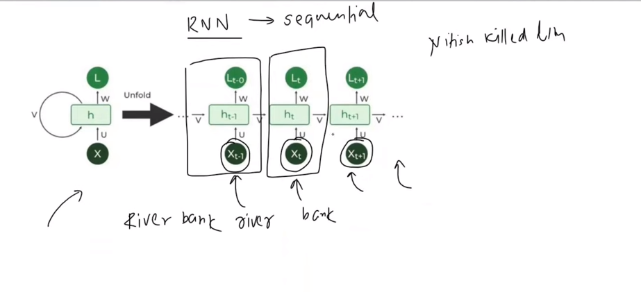

**Self Attention VS RNN:**

- Self Attention দিয়ে আমরা, Contextual embedding generate করতে পারি । 
- আমরা parallely অনেক গুলো, embedding একই সাথে generate করতে পারি ।
- RNN এ ভিন্ন ভিন্ন timestep এ একটা sentence এর word sequencilly ইনপুট হিসেবে যাই । 
- RNN, Sequence store করতে পারে । কিন্তু, আমরা,self attention এ এইটা পারি না । এর জন্য আমাদের positional encoding দরকার । 

Example: 
Nitesh killed lion.
Lion killed Nitesh.

`RNN এর কাছে sentence দুইটা আলাদা । কিন্তু, Self Attention এর কাছে দুইটা sentence এর মিনিং একই । কারণ, Self Attention Sequence store করে না ।`

 
 
 
 

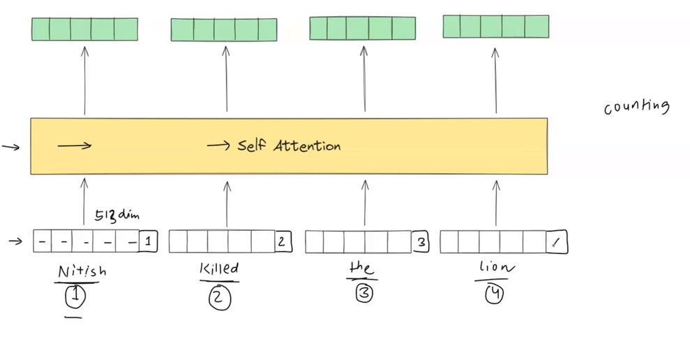

আমরা প্রথমে, general embedding বের করি । যেখানে, embedding এর সাইজ, (512) dimention এর হয়ে থাকে। এখন, let's add one more dimention (513), আমরা যদি position মনে রাখার জন্য integer ব্যবহার করি তাহলে, যদি আমাদের corpus এর সাইজ অনেক বড় হয় সেক্ষেত্রে আমাদের position 1 Bllilion পযন্ত যেতে পারে -> (Unbounded) problem । আর, self-attention is nothing but a neural network। যদি এত বড় সংখ্যা থাকে, তাহলে unstable gradient প্রবলেম হবে । আমরা জানি, neural network love normalized data range between (-1 to 1) । এখন, আমরা যদি integer গুলো normalized করি তাহলে,?? 

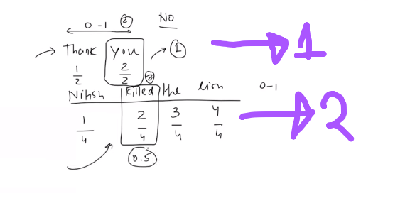

ধরি, আমাদের কাছে দুইটা sentence আছে । এখন, প্রথম sentence 2 , 2nd sentence 4 টা word আছে। যদি নরমালাইজ করি তাহলে, প্রথম sentence 2 দিয়ে আর 2nd sentence 4 টা ভাগ করবো । এতে আমাদের পজিশনের ভ্যালু (0~1) এর মধ্যে থাকবে । কিন্তু, প্রথম sentence এ 2nd word এর position ১ আসবে ২ দিয়ে ভাগ করার পর । কিন্তু, দ্বিতীয় sentence এ 2nd word এর position ০.৫ আসবে । Normally, দুই জায়গায় সেম ভ্যালু আসার  কথা ছিল । কিন্তু, যেহেতু, দুইটা আলাদা আলাদা অর্থাৎ, inconsistance position আসতেছে । 

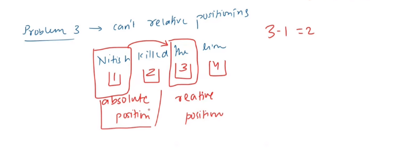

আমরা যদি integer নাম্বার ব্যবহার করি তাহলে, আমাদের পজিশন absolute হবে । আমরা যদি ১ এর ৩ মধ্যে distance জানতে চায়, তাহলে এক্ষেত্রে (৩-১) করতে হবে । একটা neural network এর মধ্যে relative position জানার জন্য একটা substaction চালালে, computation cost অনেক বেশি হয়ে যাবে । তাই, এইটাও আমাদের ভালো apporach নয় । তো, আমরা করতে পারি যে, একটা repetative function ব্যবহার করতে পারি । যাতে position একটা range এর মধ্যে থাকে। আর, relative position বের করাও সহজ হয়ে যায় । Continous হবে যেমনঃ sin । 

 
 

# `# Positional Encoding with sin Function: `

 

**1st principle solution:**

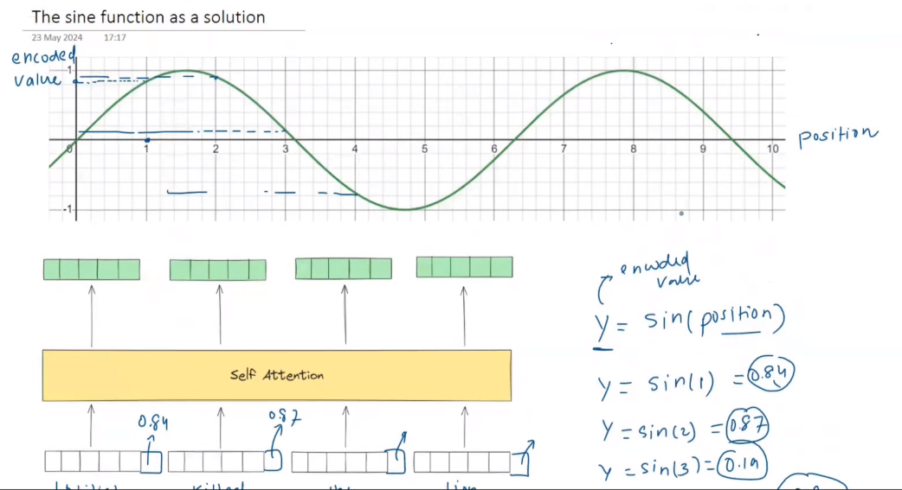

সাইন কার্ভ X-axis এ position and Y-axis encoded value আছে। 
for position, 
1, we get sin(1) = 0.84
2, we get sin(2) = 0.87
3, we get sin(3) = 0.19

সাইন কার্ভ,

- Unbounded Problem Solve হয় । 
- Discreate Problem Solve হয় । 
- Relational Position সহজে বের করা যায় । 

`কিন্তু, Sin curve use করলে একটা সমস্যা আছে । Sin Curve হলো perodic, এর Perodicity এর কারণে, যদি ২ এর sin value 0.87, সামনে মনে করি, ৩৬ এর sin value 0.87 আসতে পারে । ফলে, যেখানে, দুইটা word এর position আলাদা হওয়া সত্বেও এদের ভ্যালু একই হচ্ছে । এই সমস্যাটির সমাধানের জন্য আমরা দুইটা, perodic function ব্যবহার করতে পারি । like: y = sin(x) and y = cos(x) `

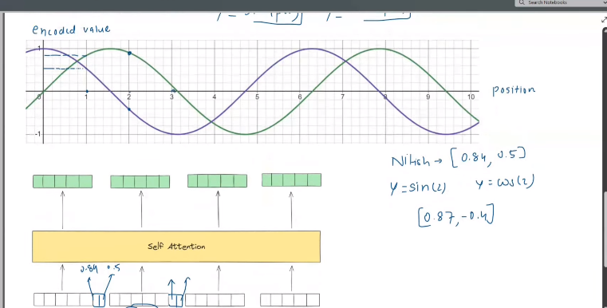

আগে যেখানে, y = sin(x) এর জন্য একটা ভ্যালু পেতাম এখন আমরা সেখানে, দুইটা ভ্যালু বা vector পাবো । একটা y1 = sin(x) and y2 = cos(x) এর জন্য এখন আমরা আমাদের position, like for the word Nitesh[y1 y2] = [0.23 0.56] । কিন্তু, এইখানেও একটা প্রবলেম আছে, কোন এক সময় এমন হবে যে, এই দুইটা vector এর মানও সমান হয়ে যাবে । 

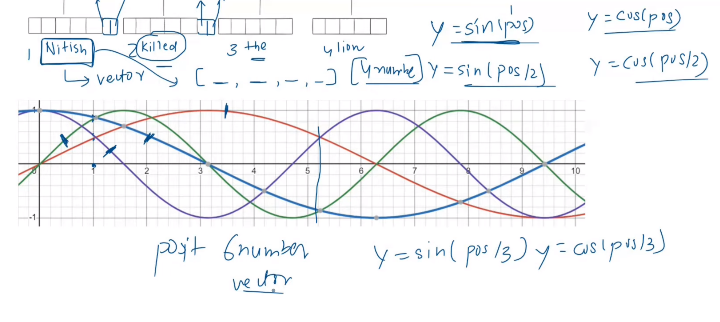

সেক্ষেত্রে, আমরা আরো দুইটা function add করতে পারি,y1 = sin(x), y2 = cos(x),y3 = sin(x/2),
y4 = cos(x/2) এখন, কোন এক সময় এরাও ম্যাচ করবে, যদি আমার corpus এর সাইজ আরো বাড়তে থাকে । তাহলে, আমরা একই ভাবে আরো একটা pair add করবো, y1 = sin(x), y2 = cos(x),y3 = sin(x/2),
y4 = cos(x/2), y5 = sin(x/3), y6 = cos(x/3), [y1 y2 y3 y4 y5 y6] আমরা 6 dimention এর vector পাচ্ছি । এইভাবে, আমাদের corpus এর সাইজ বাড়তে থাকলে আমরা আরো pair add করতে থাকবো । 

 

# `Now, How positional Encoding are introduce in Research Paper: `

 

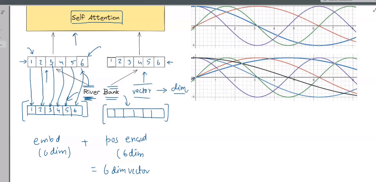

Orginal paper এ আমরা, শুরুতে tradition embedding technique (OHE,TF-IDF,Word2Vec) দিয়ে শুরুতে যে embedding বানাই পরে সেইটা সাথে, positional vector হিসেবে, একই dimention এর vector বানায় । ধরি, `Bank` word এর tradition embedding এর dimention (6) তাহলে আমাদের positional vector এর dimention ও হবে (6) । এরপর আমরা এই দুইটা কে add করি । আমরা, কিন্তু, এদেরকে concatenate করি না । Concatenate করলে dimention হবে (12), পরে যখন আমরা এইটাকে, self attention block দিবো, তখন আমাদের computation time অনেক অনেক increase করবে । `এখন,প্রশ্ন হচ্ছে কীভাবে আমরা এই positional vector এর মান গুলো বের করবো?`

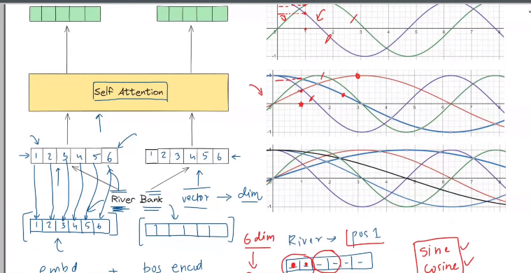

আগের মতো, দুইটা দুইটা value নিব pair আকারে, y1 = sin(x), y2 = cos(x), কিন্তু, y3,y4 এর frequency y1 and y2 থেকে কম হবে, উপরের চিত্রের মতো । y5,y6 এর frequency y3 and y4 থেকে কম হবে, উপরের চিত্রের মতো । `এখন, প্রশ্ন হচ্ছে, এই frequency এর মান গুলো কীভাবে বের করবো?`

 

# `# Value of the amplitude from (All the attention you need:)`

 

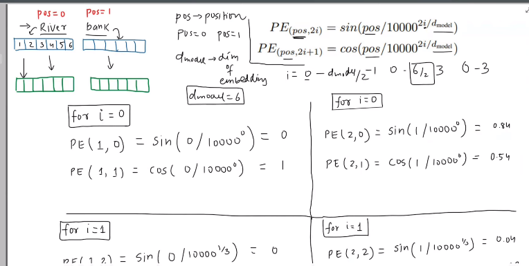

 

আমরাতো, দুইটা pair নিয়ে কাজ করেছি, উপরের ছবিতে, (PE,PE) হলো সেই দুটো pair । এখন, 
সেখানে, 
- pos হলো Position (zero থেকে শুরু হয়ে যত গুলো word থাকবে ) 
- d_model হলো embedding vector এর dimention.
- i এর ভ্যালু শূন্য থেকে শুরু হয়ে, {(d_model/2) - 1}

 
 

**Calculate the positional vector: for `river and bank` (need for understanding a graph)**

**note: Correction: position 0 for River**
**note: Correction: position 1 for Bank**

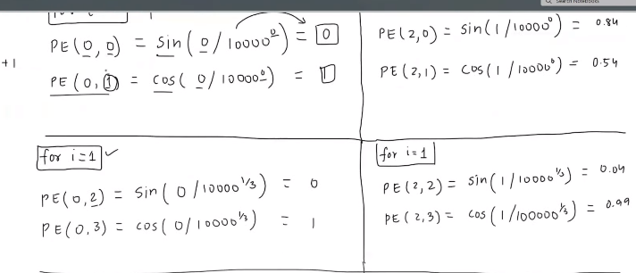

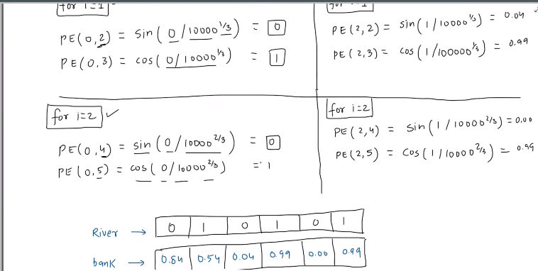

 
 

# `#Visulization? why we decrease the frequency?`

 
 

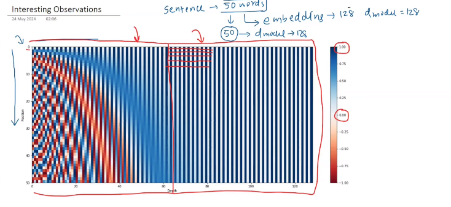

আমাদের কাছে,  sentence  এ 50 টা word আছে, যেইটা উপরের ছবিতে, Y-axis এ আছে । এর প্রত্যেকটা word এর embedding vector এর dimention হলো 128 । Hense, আমাদের, positional vector এর dimention ও 128 হবে । Y-axis এর 0  তে আমাদের প্রথম word এর embedding, এইভাবে, প্রথম থেকে ৫০ টা word এর embedding আছে । উপরের, ছবির বাম পাশে lower_dimention আর ডান পাশে heigher dimention এর positional vector এর value গুলো আছে । higer dimention এ ভ্যালু গুলো তেমন পরিবর্তন হচ্ছে না কারণ, আস্তে আস্তে আমাদের frequency কমতে থাকে । white->0 blue-> 1 উপরে আমরা যখন, (river) এর positional encoding vector বের করছি তখন, দেখলাম, এর ভ্যালু টা 0 1 0 1 0 1 এই রকম দেখাচ্ছে । 

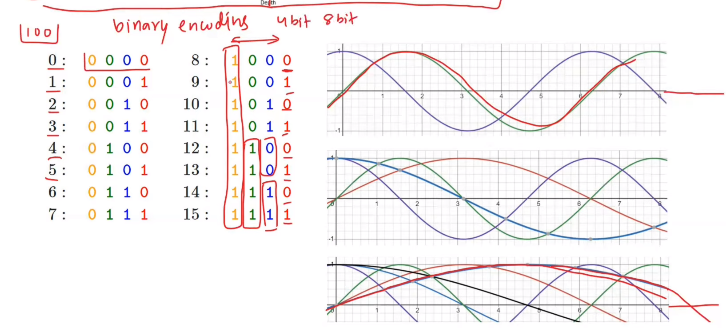

Binary Encoding ( Decimal থেকে যখন আমরা বাইনারি তে, convertion করতেছি ), 4bit এর ক্ষেত্রে, শেষের word টার(লাল) frequency বার বার change হচ্ছে । এর আগেরটা প্রতি দুইবার পর, তার আগেরটা চার বার, এর আগের টা আটবার পর change হচ্ছে । যারা খুব তাড়াতাড়ি change হচ্ছে তাদের frequency অনেক বেশি, আর যারা কম কম হচ্ছে তাদের frequency কম । আমরা binary number use করি নাই কারণ এটা discreate, mainly author এই ধারনা থেকে continous value পাবার জন্য (sin,cos) এর ধারনা ব্যবহার করেছে । 

 

# `# How (sin,cos) pair resolve the problem of relative position: `

 

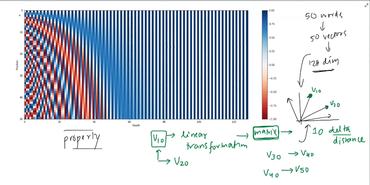

`আমরা y-axis থেকে যেকোন একটা positional vector নিব, ধরি, ১০ নিলাম, সেই  positional vector এর সাথে linear transformation করবো(একটা matrix দিয়ে গুণ করবো) তাহলে আমরা ২০ এর positional vector টা পাবো । এইটা শুধু মাত্র ১০ পার্থক্য এর জন । আমরা ইচ্ছে করলে এইভাবে, বিভিন্ন টার জন্য বানাতে পারি । `

[**matrix টা কেমন হবে সেইটা এই blog থেকে পড়তে পাড়বে**](https://blog.timodenk.com/linear-relationships-in-the-transformers-positional-encoding/)

