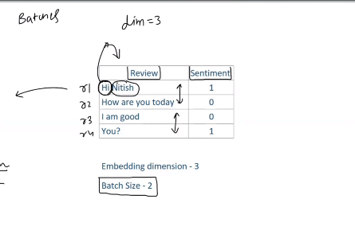
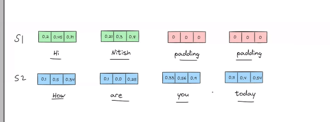
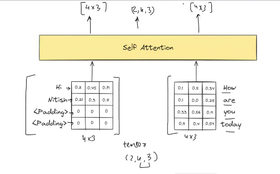
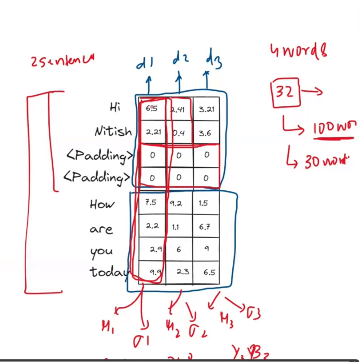
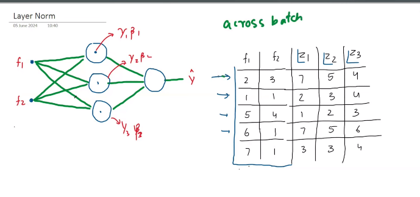
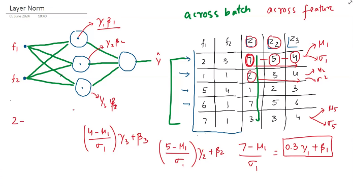
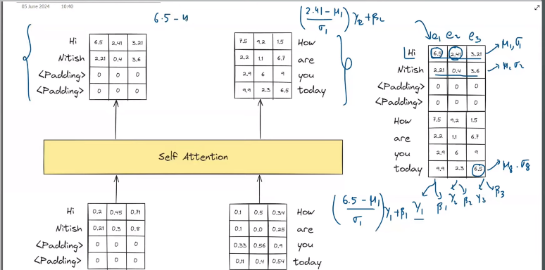

 
 

# `# Layer Normalization: `

 
 

---
---
---

 
 
 

# `#1 First, revise the concept of Batch_Normalization: `

[**Batch Normalization**](https://github.com/yasin-arafat-05/100DaysDL/blob/main/note/31_Batch_Normalization.pdf)

 
 
 

# `# 02: Problem with Batch_NOrmalization in self-attention: `

আমরা এতক্ষন, self-attention এ শুধু মাত্র একটা sentence input হিসেবে দিয়েছি । চলো, একটু complexity যোগ করি । এইবার আমরা batch হিসেবে(batch_size=2,traditional_embedding_dim=3), একাধিক sentence input হিসেবে দিব । Let's do sentiment analysis,

কিন্তু, সমস্যা হচ্ছে, আমাদের প্রথম বাক্য এ, দুইটা word আর ২য় বাক্যে four words আছে, simple solution আমাদের  padding করা লাগবে, 

এইবার আমরা, এদেরকে self attention block এ পাঠাতে পারি,(for more simplification we can combine into a matrix) 

We can, say we are sending a tensor(2,4,3) where, 2 is batch size. In, the output we will also get a tensor(2,4,3). For, padding we will get zero (ভিতরে তো matrix multiplication আমরা করতেছি). এখানে, যেহেতু, আমাদের embedding vector এর ভ্যালু গুলোর range(more than 1) তাই, আমাদেরকে একে normalize করতে হবে । Let's apply batch normalization. For appling batch normalization, Output কে stack up করবো । 

কিন্তু, আমরা তো batch normalization, একটা batch এর উপর apply করি । এখানে, আমরা প্রথম column কে সিলেক্ট করে এর mean and standard deviation বের করবো । আর, এরপর faxibility provide করার জন্য আমরা জানি, beta and gamma থাকবে । কিন্তু, সমস্যা হচ্ছে, এখন, আমাদের কাছে, এমন একটা corpus থাকলে, যেখানে, longest document 100 words এর আর, maximum document 32 words এর তাহলে, আমাদের padding হিসেবে অনেক শূন্য থাকবে, যেইটা যেই sentence এর word number কম তাদের জন্য আমরা যে mean and standard deviation বের করবো, সেইটা তাদের সাথে যাবে না । তাই আমরা, self attention এ batch Normalization ব্যবহার করি না । `Solution Layer Normalization.`

 

# `# Layer Normalization: `

 

এখানে, f1,f2 হলো input আর z1,z2,z3 হলো, hidden layer এর perception গুলোর activation এর আউটপুট । 

Batch Normalization আমরা across the batch এ নিয়েছিলাম, এইবার আমরা across the feature নিব। অর্থাৎ, আগে column বরাবর নিয়ে ছিলাম এখন আমরা  row বরাবর নিয়ে, আগের মতো same formula apply করবো । 

 

সুবিধা হচ্ছে আগে যেখানে, padding এর ভ্যালু নিয়ে যামেলা হতো, এইভার এইখানে হবে না । 

 
