 
 

# `# Transformer Encoder Part: `

 
 

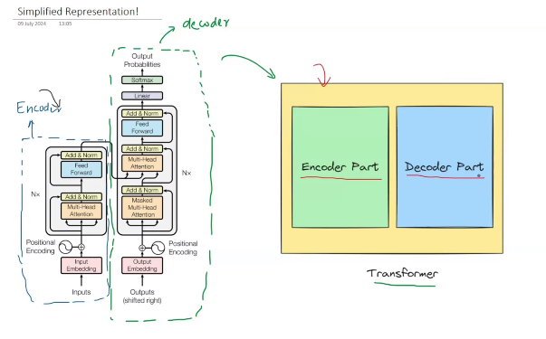

##### `Research Paper এর Transformer এ ৬টা Encoder  and Decoder Block ব্যবহার করা হয়েছে । তাই, আমরা ইচ্ছে করলে আমাদের নিজের মতো এই সংখ্যা বাড়ানো কমানো যাবে । তবে,  ৬টা ব্যবহার করার কারণ হচ্ছে, ৬টা দিয়ে বেস্ট রেজাল্ট পাওয়া যায় । তাই, উপরের চিত্রে Nx ব্যবহার করা হয়েছে ।  `

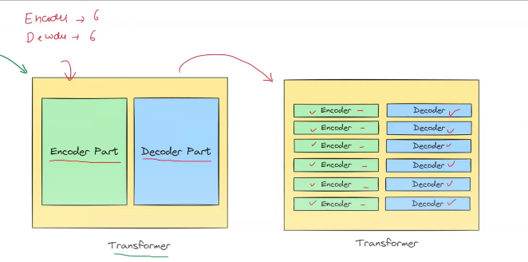

##### `একেকটা encoder block এ, একটা Self-Attention Block and একটা Feed Forward Neural Network Block থাকে । Diagramtically, দেখতে নিচের মতো হয় । ` যেখানে, ADD মানে আমরা Residual Connection ব্যবহার করে addition । আর, Norm মানে Normalization, আমরা আগেই জেনেছি, আমরা Transformer এ layer Normalization ব্যবহার করি । Neural Network Block ব্যবহার করার কারণ হচ্ছে, আমরা এতে relu activation ব্যবহার করে, non-linearity capture করতে পারবো । 

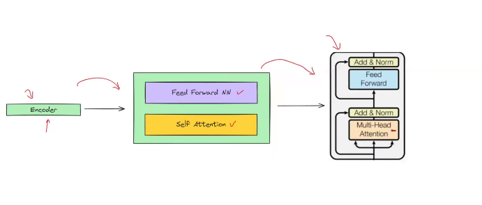

### `Total 6 Encoder Block Then we get Our Output:`

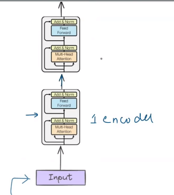

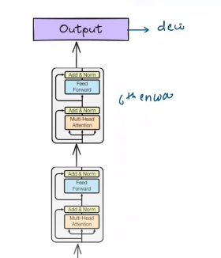

# `#01 Let's take a example sentence: `

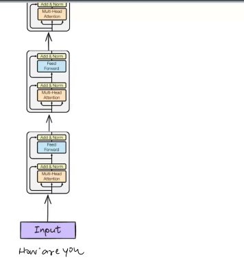
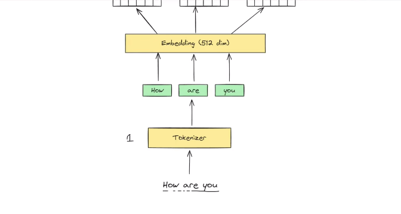
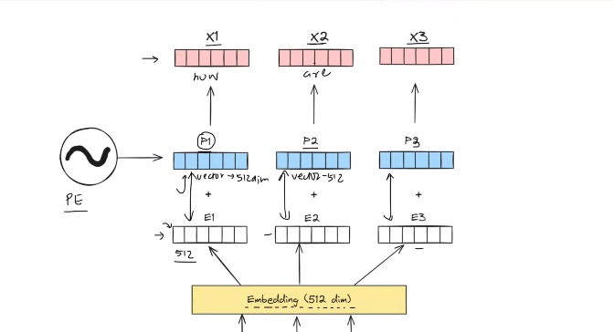

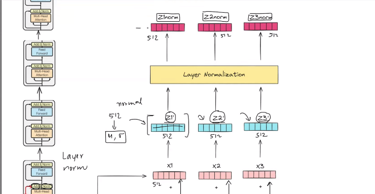

 
 

# `#02 Encoder Feed Forward Network: `

 
 

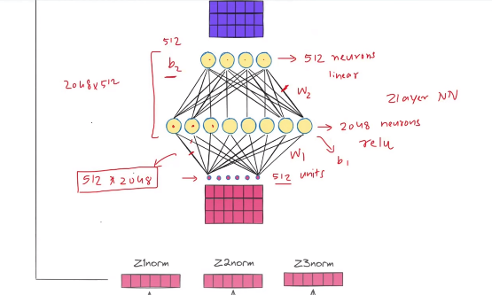
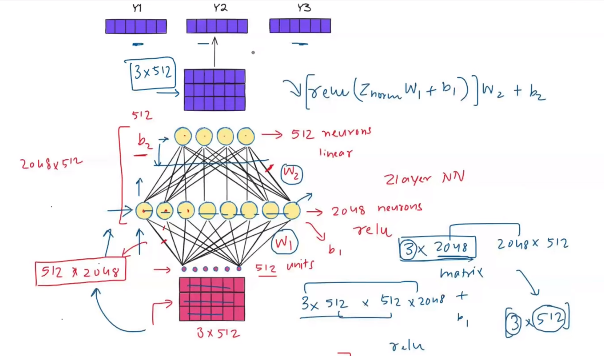
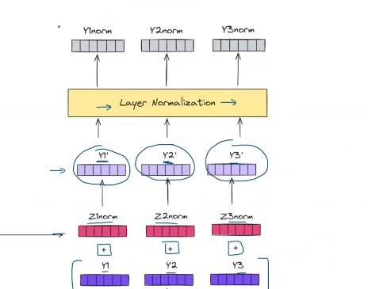

 
 

# `#03 Some important Question: `

 
 

### `1. Why use residual connections?`
### `2. Why use FFNN?`
### `3. Why use 6 encoder block?`

