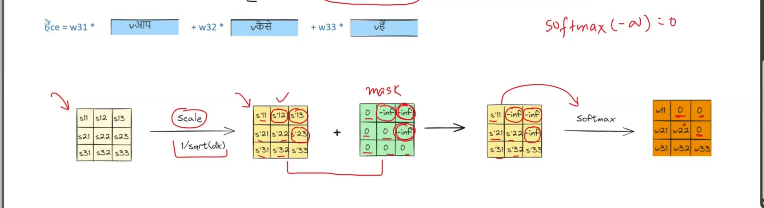

---
---

 
 

# `# Masked Multi Head Attention: `

 
 

---
---

 
 

 
 

 

`Softmax and Scaling করার পর আমরা attention score পাচ্ছি এর সাথে আমরা একটা mask যোগ করে দিব । এই ধরনের attention কে আমরা Masked Multi Head Attention বলতেছি । যেখানে যেখানে আমাদের শূন্য দরকার সেই ভ্যালু গুলোতে` $-\infty$ ` বসিয়ে দেয় । তারপর এর সেইটা আমরা, attention score ম্যাট্রিক্স এর সাথে যোগ করি । আর আমরা জানি,  `

$\text{softmax}(z_i)$ = $\frac{e^{z_i}}{\sum_{j} e^{z_j}}$

where $z_i$ represents the $i$-th element of the input vector, and the denominator is the sum of the exponentials of all elements in the vector.

In **masked multi-head attention**, the value of $\text{softmax}(-\infty)$  is **0**.

### Why?  
The softmax function is defined as:
$\text{softmax}(z_i)$ = $\frac{e^{z_i}}{\sum_{j} e^{z_j}}$

- If $z_i$ = $-\infty$, then $e^{- \infty}$ = 0 .
- This makes the numerator of $\text{softmax}(-\infty)$ = **0**, regardless of the denominator.

**Thus:**

$\text{softmax}(-\infty)$ = 0

 

