---
---

 
 

# `# Cross Attention: `

 
 

---
---

 

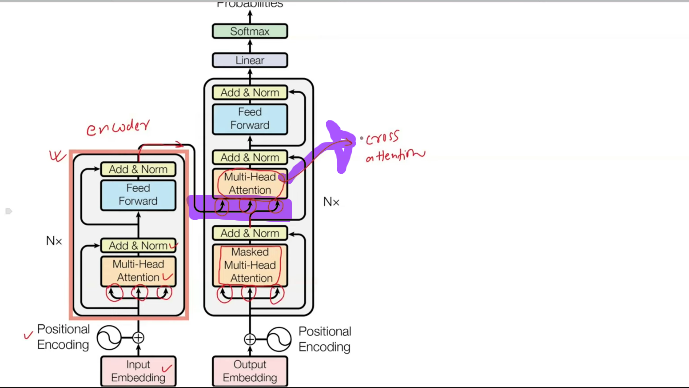

`উপরের ছবিতে, encoder এ যখন আমরা multi-head-Attention দেখেছি, তখন আমাদের Query,key and value vector আমাদের ইনপুট থেকেই নিয়েছি । কিন্তু, decoder এর ক্ষেত্রে লক্ষ্য করলে দেখবো দুইটা arrow encoder থেকে আসতেছে । অর্থাৎ, আমাদের Query,key and value vector এর যেকোন দুইটা encoder থেকে আসবে একে আমরা Cross Attention বলতেছি ।  `

### `চলো আর একটু details এ জানি ঃ  `

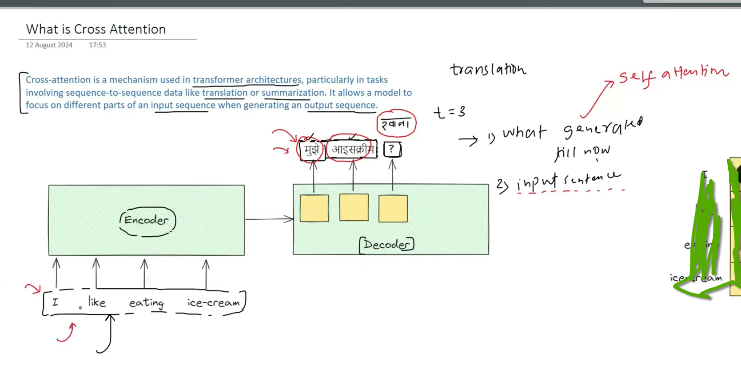

From the defination, Cross attention, text translation, summarization এর ক্ষেত্রে ইনপুট এর সাথে আউটপুট sequence এর সম্পর্ক নির্ধারণ করে । "I like eating ice-cream" এর বাংলা translation এর ক্ষেত্রে "আমি আইসক্রিম ? ? " আইসক্রিম এর পরে কি হবে সেইটা দুইটা বিষয়ের উপর নির্ভর করতেছেঃ 

- এখন পর্যন্ত কি কি generate হয়েছে । 
- ইনপুট sentence এ কি আছে । 

1st, `"এখন পর্যন্ত কি কি generate হয়েছে"` decoder এ যে masked multi-head attention ব্যবহার করেছি সেইটা দিয়ে সহজেই বের করতে পারবো । আর input sentence এর সাথে output sentence এর কি সম্পর্ক সেইটা আমরা নিচের ছবির মতও তুলনা করতে পারি । একটা matrix যেখানে, Row-> input sequence , Column-> output sequence থাকবে । এই matrix টা হচ্ছে আমাদের Attention-Score Matrix.

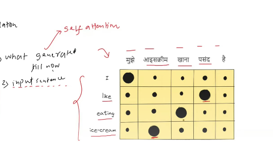

গোল যত বড়, সেই word এর সাথে উপরের হিন্দি word এর তত মিল । `same language এর sentence এ sequence গুলোর মধ্যে সম্পর্ক বের করার জন্য Self Attention, আলাদা দুইটা language এর sentence এ sequence গুলোর মধ্যে সম্পর্ক বের করার জন্য  **Cross Attention** ব্যবহার করা হয় । `

 

### Cross Attention is Conceptually Very Similar To Self-Attention:

**Self-Attention VS Cross-Attention:**

- Input
- Processing
- Output

`উপরের তিন ক্ষেত্রেই পার্থক্য রয়েছে । `

 

## `# Self-Attention VS Cross-Attention (Input)`

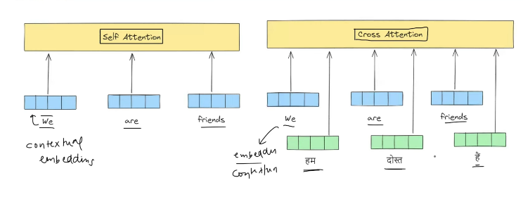

`Self-Attention এ আমরা শুধু একটা Input Sequence, Input হিসেবে দিতেছি । অন্যদিকে, Cross-Attention এ আমরা Input Sequence + Output Sequence ("হাম দোস্ত হে") দুইটায় Input হিসেবে দিতেছি । `

# `# Self-Attention VS Cross-Attention (Processing)`

### Revise Self-Attention: 

**`1) General Embedding থেকে key,Query,Value Matrix থেকে, Key,Query,Value Vector এর মান বের করা । `**

**`2)  Key,Query Vector গুন করে Scaling and Softmax Operation করে যে Attention Score পাই এর সাথে Value Vector গুন করলে আমরা Contextual Embedding পায় । `**

**`3) Contextual Embedding গুলোর relation কে আমরা নিচের  (Attention-Score) matrix  দিয়ে তুলনা করতে পারি । `**

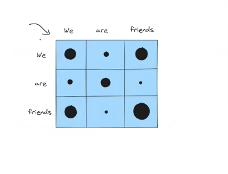

 

### Now, Cross-Attention:

 

**`1) Cross Attention এ আমরা যখন Query Matrix থেকে, Query Vector Generate করি তখন, General Embedding হিসেবে আমরা Output এ সেই word এর Embedding ব্যবহার করি । Output বলতে, যদি আমরা English to Bangla Translation এর কাজ করি তাহলে, Bangla Word হবে Output । `**

**`আর, General Embedding(Input) -> (English) থেকে key,Value Matrix থেকে, Key,Query,Value Vector এর মান বের করা । `**

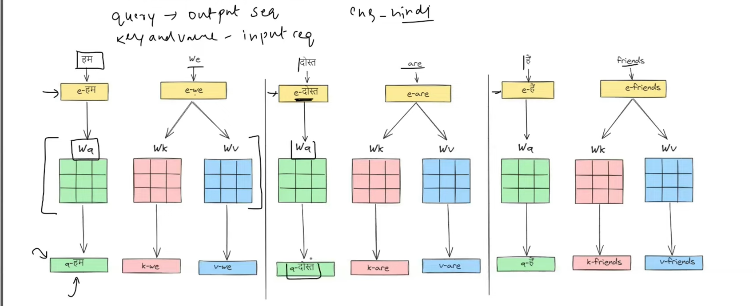

**`2)  Key,Query Vector গুন করে Scaling and Softmax Operation করে যে Attention Score পাই এর সাথে Value Vector গুন করলে আমরা Contextual Embedding পায় । `**

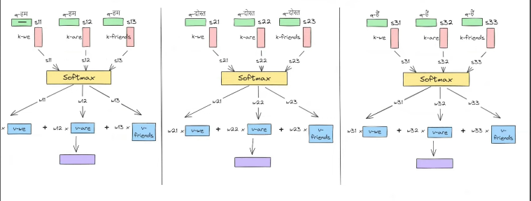

**`Cross-Attention এর ক্ষেত্রে আমরা, Attention-Score Matrix কে নিচের মতো তুলনা করতে পারি । `**

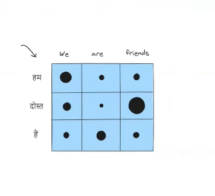

- We এর সাথে "হাম" ।
- Are এর সাথে "হে" ।
- Friends এর সাথে "দোস্ত" । 

`Simillarity বেশি । `

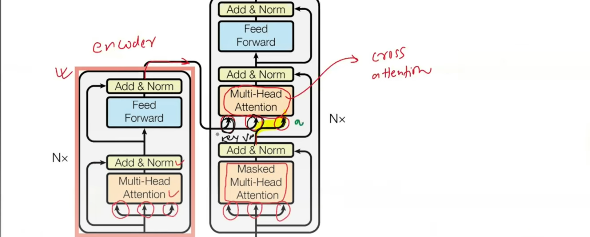

`From the picture, Key and Value ভেক্টর Encoder থেকে আসতেছে, অন্যদিকে Query vector Decoder থেকে । `

 

# `# Self-Attention VS Cross-Attention (Output)`

 

Cross-Attention এর আউটপুট হিসেবে আমরা শুধু এখানে(English to Hindi) translation করতেছি । আমরা hindi word গুলোর Embedding পাবো । যেইটা, Input word(English) এর Embedding সাথে সর্ম্পক থাকবে । 

 

# `# Cross-Attention VS Bahdanau and Luong Attention: `

 

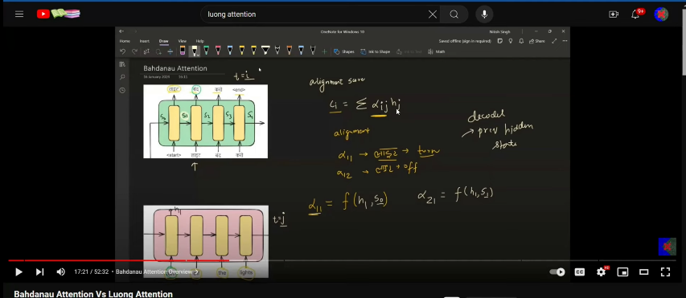

`Cross Attention অনেকটা  Bahdanau and Luong Attention এর মতো । Simple Encoder and Decoder Archetecture পড়ার সময়, Translation(English to Hindi) এর ক্ষেত্রে আমরা যখন  কোন hindi word প্রিন্ট করবো তখন আমরা সেই Word টার সাথে  English কোন Word টার সবচেয়ে বেশি মিল রয়েছে আমরা সেইটা দেখতাম । Cross-Attention এও আমরা তাই করতেছি  । এই মিল বের করার জন্য আমরা প্রত্যেক TimeStep এ একটা context vector Calculation করতাম । যেইটা উপরে, $C_i$ দিয়ে প্রকাশ করতেছি । এই context vector বের করার জন্য আমরা Bahdanau Attention এ আমরা Neural Network আর  Luong Attention এ আমরা Dot product করেছি ।`

### `যারা, Transformer নিয়ে কাজ করেছে । তারা এইখান থেকেই আইডিয়া নিয়েছে । `

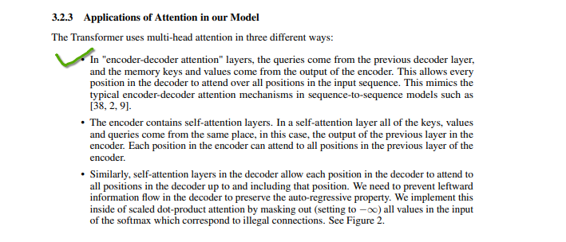

উপরের, mark করা লাইনটা দিয়েই তারা indirectly বলে দিয়েছে তারা Bahdanau and Luong Attention থেকে ধারনা নিয়েছে । 

 

# `USE CASE: `

`যেখানে, আমাদের দুইটা sequence থাকে সেই খানে আমরা Cross-Attention ব্যবহার করি । `

- Language Translation
- Multi-Modal (Image to Caption Generation) (Input->Image, Output->Text)
- Text to Image
- Text to Speech

