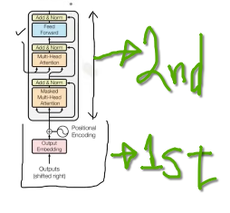
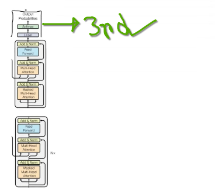
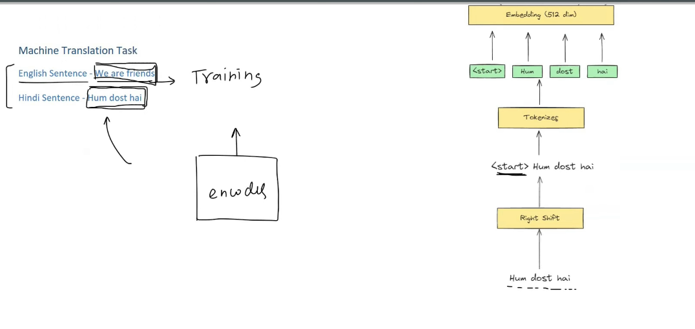

 
 

# `#Transformer Decoder Architecture: `

 
 

### `Simplified Representation of Decoder Block`

`উপরে, ৬ টা Decoder এর মধ্যে ১টা Decoder এর Simplified Representation দেওয়া হয়েছে । ১টা Decoder Block এর মধ্যে ১টা Masked Self Attention Block, ১টা Cross Attention Block আর একটা Feed Forward Neural Network Block আছে । `

 

# Plan of Attack: 

 

 

`Decoder কে আমরা উপরের ছবিতে দেখানো ৩টা পার্টে ভাগ করে পড়বো । Task হিসেবে আমরা, Machine Translation Task নিয়ে কাজ করবো । `

**Machine Translation: (English to Hindi)**
- `English Sentence:` We are Friend
- `Hindi Sentence:` Hum Dost Hai

### **আমরা দেখবো Training Phase:(decoder non-autoregressive) এর জন্য**

`English Sentence Input হিসেবে আমাদের, Encoder এ যাবে । আর Decoder তার কাজ শুরু করার আগে, Encoder এর কাজ শেষ হয়ে থাকবে, অর্থাৎ, আমরা, English Sentence এর Words গুলোর জন্য আমাদের contextual embedding তৈরি হয়ে থাকবে।`

 

# 1st Part:

- Shifting
- Tokenization
- Embedding
- Positional Encoding

``
