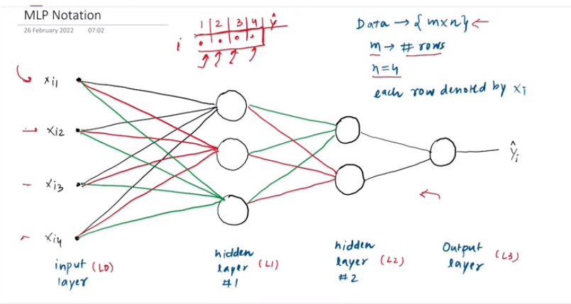
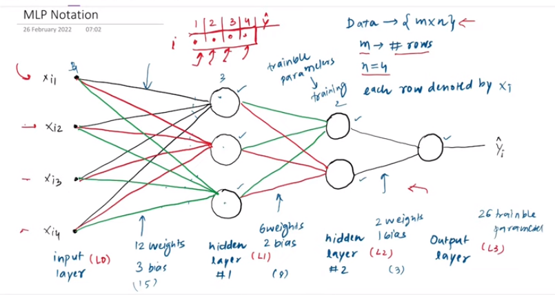

---

# Multi-layer Perceptron:

---

Perceptron কে train করার জন্য আমরা bakpropagration algorithrm ব্যবহার করি।  যেইটা এইটা একটু complex । এই complexity থেকে দূরে থাকার জন্য আমাদের neural network এর  ব্যাসিক notation গুলো জানতে হবে । 

শুরুতে আমরা দেখবো, 
- আমরা number of trainable parameter (weights and bias) কত গুলো তা বের করবো । 
- এই weights and bias গুলো কীভাবে denote করি । 

এইখানে আমাদের ডাটাসেট m*n আকারের matrix  আকারের আছে । ইনপুট, x_i1,x_i2,x_i3,x_i4 , (x_i1) i-th row এর 1st column, (x_i2) i-th row এর 2st column and এইভাবে বাকীগুলো । 

input layer এ 4 টা node এর পরের hidder layer এ 3 টা node  
total weight = 4*3 = 12   
total bias (hidden layer node-> 3 ) = 3   
In total, 15.  
 
similarly এইভাবে বাকী গুলো বের করবো ।  

   

### Notation of weights and bias:

- `Bias and output:` b_ij এখানে,  i হচ্ছে layer number and j হচ্ছে সেই layer এ কত তম node . কোন node এর ouput এর notation ও সেম । 

- `Weights: ` W এর power এ যেইটা থাকবে সেইটাতে denote করে কোন layer এ যাচ্ছে । W এর নিচের প্রথমটা mean করে এটা কোন layer থেকে বের হচ্ছে । পরের টা mean করে কোন layer এর কত number node এ যাচ্ছে । 

