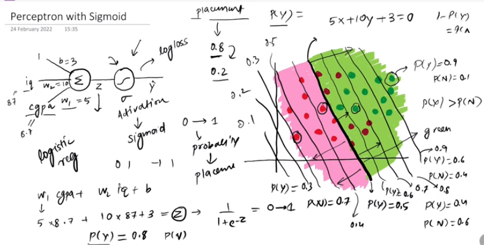
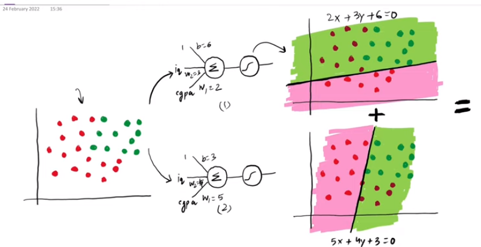
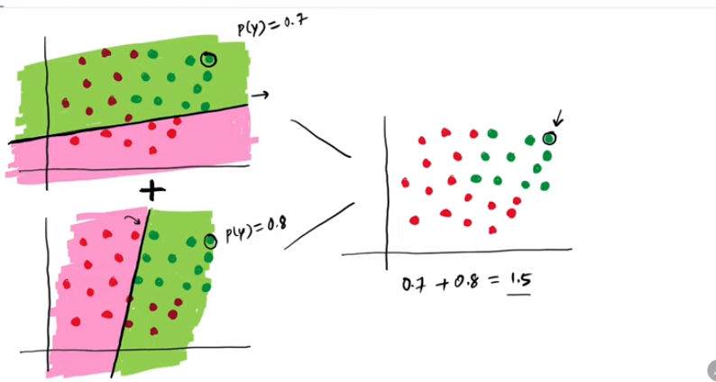

---

# Problem with Perceptron:

--- 

Perceptron একটা liner model এইটা non-linear decision boundary create করতে পারে না এর জন্য আমরা MLP(multi-layer perceptron) ব্যবহার করি । MLP ব্যবহার করে একটা বড় neural network বানাতে পারি যেইটা universal function approximator হিসেবে কাজ করে non-linear decision boundary create করতে পারবে । 

 

এইখানে, আমাদের একটা dataset এ দুইটা class আছে । এই class দুইটাকে আলাদা করার জন্য আমাদের একটা boundary লাগবে যেইটা non-linear decision boundary . আমরা perceptron ব্যবহার করে এই non-linear decision boundary create করবো।  

---

# How perceptron work with sigmoid

---

এখানে আমরা, activation funciton  হিসেবে sigmoid function আর loss function হিসেবে logloss function ব্যবহার করবো । logloss যেইটা logistic regression এর equivalent . Picture from sk-learn documentation:

   

iq,cgpa and placement এর example এর ক্ষেত্রে,  

cgpa = 3.7, iq = 8.7, w_1 = 5, w_2 = 10 and b = 3, আমাদের model এর equation হচ্ছে, W1 * cgpa + W2 * iq + b 
এখন, z এর মান  z = W1 * cgpa + W2 * iq + b  calculation করে আমরা যেই মান পাবো সেইটা activation function (sigmoid) এ বসিয়ে এই node এর output পাবো । 
 

sigmoid এর output এর range (0 ~ 1 ) । আমাদের যেই model আছে সেই model এর উপর sigmoid এর ouput হবে 0.5 । এর পর উপরের দিকে sigmoid এর output 0.5 এর থেকে বেশি (placement এর probability p(Y->yes) বাড়বে ) হবে  similarly placement না হওয়ার probability p(N->no) কমবে ।  

 

### Multilayer perceptron visulization: 

এখানে আমরা দুইটা perceptron এর model generate করেছি । তারপর এই দুইটা টা perceptron এর decision boundary কে আমরা add করবো । তারপর সেইটাকে smooth করে নতুন একটা non-linear decision boundary পাবো । 

 

`উপরের জিনিসটা mathematically কীভাবে proof করা যেতে পারেঃ `

আমরা প্রথমে ডাটাসেটের একটা point এর সাপেক্ষে দুইটা model এর output বের করছি । প্রথমটা 0.7 এবং দ্বিতীয় টা 0.8 । তারপর এই দুইটার probability যোগ করে পাই, 1.5 কিন্তু আমাদের ভ্যালু এর range ( 0 ~ 1) এই ভ্যালু কে আমরা আবার, sigmoid function এ দিয়ে যেই ভ্যালু পাবো সেইটা হচ্ছে final ans . এক্ষেত্রে, 0.82 অর্থাৎ তার placement done. এইভাবে আমরা non-linear decision boundary বের করতে পারি । 

 

